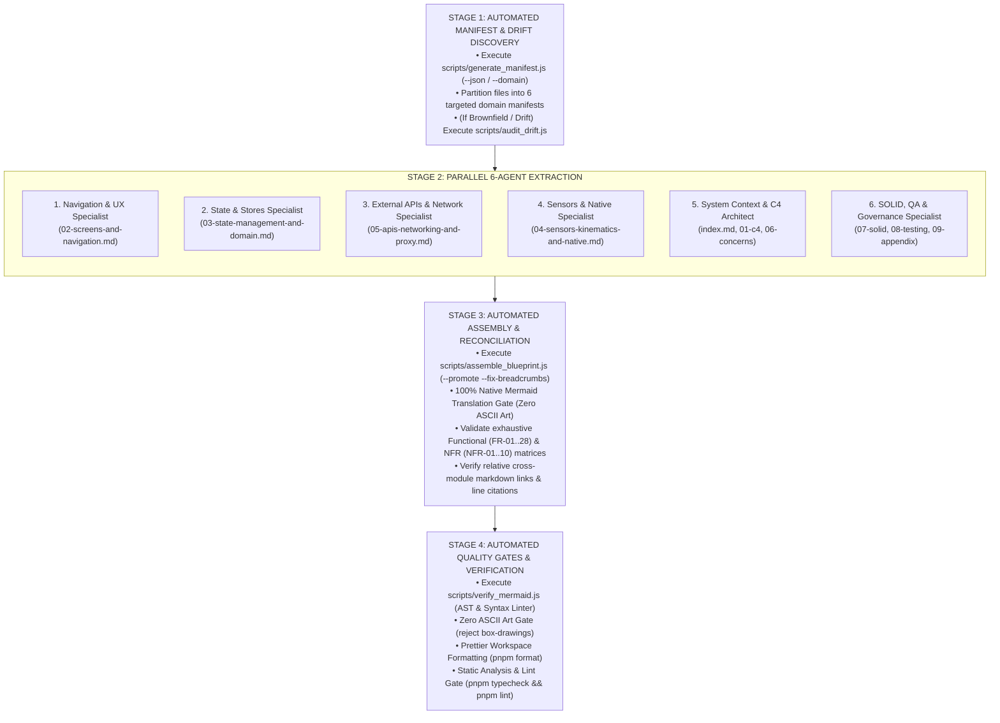

# System Design Architect Skill (Modular Architecture)

This skill guides the agent through an automated, multi-agent process to reverse-engineer, structure, audit, and document an entire software system into a **Modular System Design Blueprint** inside `docs/architecture/`.

---

## Output Topology: Modular Architecture (`docs/architecture/`)

The generated design documentation is structured into **10 cohesive, focused markdown modules**:

```text
docs/architecture/
├── index.md                              # Module 0: Executive Summary, Mission, Functional/NFR Catalogs & System Map
├── 01-c4-context-and-containers.md        # Module 1: C4 Level 1 Context & C4 Level 2 Container Diagrams
├── 02-screens-and-navigation.md           # Module 2: Route Catalog, Screen Specs, Route Topology & Navigation State Machine
├── 03-state-management-and-domain.md      # Module 3: Zustand Store Inventory, UML Class Diagram, Lifecycles & Reactive Hooks
├── 04-sensors-kinematics-and-native.md    # Module 4: Accelerometer Math, Shake Gesture, GPS Telemetry, Audio Engine
├── 05-apis-networking-and-proxy.md        # Module 5: API Catalog, OAuth JWT Sequence, Web Proxy, Smart Polling
├── 06-cross-cutting-concerns.md           # Module 6: Logging Telemetry, Security Architecture, Internationalization
├── 07-solid-principles-and-patterns.md    # Module 7: Concrete SOLID Compliance Matrix with Line-Cited Proofs
├── 08-testing-and-cicd.md                 # Module 8: Test Pyramid, Native Mocks Architecture, CI/CD Pipelines
└── 09-appendix-technical-debt.md          # Module 9: Prioritized Architectural Gaps & Remediation Master Plan
```

---

## Workflow Modes & Overview



---

## Execution Modes

### Mode A: Full Greenfield / Complete Overhaul (Default)

Generates or fully rewrites all 10 modules using the complete 6-subagent parallel pool.

### Mode B: Targeted Single-Domain Update (`--module=<name>`)

When modifying a single subsystem (e.g. adding a new Zustand store or external API proxy), the orchestrator runs:

```bash
node .agents/skills/system-design-architect/scripts/generate_manifest.js --domain=<navigation_ux|state_domain|apis_networking|sensors_native|system_c4_requirements|solid_testing_governance>
```

Only the corresponding subagent is dispatched to regenerate that single module file, followed by running `scripts/assemble_blueprint.js` and the Stage 4 quality gates.

### Mode C: Architectural Drift Audit (`--drift`)

Runs automated git diff comparison against existing documentation:

```bash
node .agents/skills/system-design-architect/scripts/audit_drift.js --base=HEAD~10
```

Identifies un-documented routes, newly introduced stores, or changed API endpoints, and prints the recommended targeted regeneration commands.

---

## Stage 1: Automated Subsystem Partitioning & Prompt Interpolation

Generate the domain file manifests and ready-to-dispatch subagent prompts:

```bash
# 1. Inspect discovered domain manifests
node .agents/skills/system-design-architect/scripts/generate_manifest.js --json

# 2. Generate ready-to-dispatch subagent JSON payloads (with interpolated context & manifests)
node .agents/skills/system-design-architect/scripts/prepare_dispatch.js
```

To target a single domain or toggle between read-only research mode (zero approval prompts) and write mode:

```bash
# Generate prompt for a single domain
node .agents/skills/system-design-architect/scripts/prepare_dispatch.js --domain=state_domain

# Toggle write mode (TypeName: "self") vs research mode (TypeName: "research")
node .agents/skills/system-design-architect/scripts/prepare_dispatch.js --mode=write
```

---

## Stage 2: Parallel Multi-Agent Deep Extraction

Spawn **6 specialized domain subagents** in parallel using `invoke_subagent` using the payload generated by `prepare_dispatch.js` (`TypeName: "research"`, `Model: "inherit"`).

> 💡 **Automated Prompt Rule:** Use `node .agents/skills/system-design-architect/scripts/prepare_dispatch.js` to automatically extract persona prompts from [references/persona-prompts.md](./references/persona-prompts.md) and interpolate `{{PROJECT_CONTEXT}}`, `{{TARGET_FILES}}`, and `{{EXISTING_DOC_EXCERPT}}` seamlessly.

### Domain Persona Mapping:

|   #   | Subagent Persona                       | Target Codebase Areas                                                       | Assigned Modular Files                                                                                                                                                                                   |
| :---: | :------------------------------------- | :-------------------------------------------------------------------------- | :------------------------------------------------------------------------------------------------------------------------------------------------------------------------------------------------------- |
| **1** | **Navigation & UX Specialist**         | `app/**`, `components/**`, styling & modal hooks                            | [`02-screens-and-navigation.md`](./02-screens-and-navigation.md)                                                                                                                                         |
| **2** | **State & Domain Logic Specialist**    | `store/*.ts`, selectors, Zustand persistence, lifecycle hooks               | [`03-state-management-and-domain.md`](./03-state-management-and-domain.md)                                                                                                                               |
| **3** | **External APIs & Network Specialist** | `lib/api/**`, `app/api/proxy*`, caching, OAuth JWT, rate limits             | [`05-apis-networking-and-proxy.md`](./05-apis-networking-and-proxy.md)                                                                                                                                   |
| **4** | **Sensors & Native Specialist**        | `components/motion-cues.tsx`, `expo-sensors`, `expo-location`, `expo-audio` | [`04-sensors-kinematics-and-native.md`](./04-sensors-kinematics-and-native.md)                                                                                                                           |
| **5** | **System Context & C4 Architect**      | `package.json`, `app.json`, `lib/logger.*`, `lib/theme.*`, `lib/i18n/**`    | [`index.md`](./index.md), [`01-c4-context-and-containers.md`](./01-c4-context-and-containers.md), [`06-cross-cutting-concerns.md`](./06-cross-cutting-concerns.md)                                       |
| **6** | **SOLID, QA & Governance Specialist**  | `__tests__/**`, `jest.setup.js`, `.github/workflows/`, configs              | [`07-solid-principles-and-patterns.md`](./07-solid-principles-and-patterns.md), [`08-testing-and-cicd.md`](./08-testing-and-cicd.md), [`09-appendix-technical-debt.md`](./09-appendix-technical-debt.md) |

---

## Stage 3: Automated Assembly & Reconciliation Pass

The orchestrator collects subagent deliverables and executes the automated blueprint assembler:

1. **Automated Blueprint Assembly, Breadcrumb Injection & Staging Cleanup:**
   ```bash
   node .agents/skills/system-design-architect/scripts/assemble_blueprint.js --promote --fix-breadcrumbs
   ```
   - Automatically promotes files from `docs/architecture/.staging/` to `docs/architecture/`.
   - Automatically purges the `.staging/` directory after promotion.
   - Automatically injects/updates standardized **Top and Bottom Breadcrumb Navigation** on all 10 modules.
   - Automatically runs the **Mermaid Sanitization Preprocessor** (quotes unquoted node labels with special characters, ensures `autonumber` in sequence diagrams, escapes `<T>` to `~T~` in class diagrams).
2. **100% Mermaid Translation Gate:** Convert **ALL** ASCII / box-drawing diagrams (`┌───┐`, `+---+`, `[A] ──▶ [B]`) into standard Mermaid code blocks (`flowchart TB`, `sequenceDiagram`, `stateDiagram-v2`, `classDiagram`).
3. **Requirements Expansion Pass:** Verify that [`index.md`](./index.md) contains an **exhaustive Functional Requirements Catalog (FR-01 to FR-28)** and a quantitative **NFR matrix (NFR-01 to NFR-10)**.
4. **Header & Footer Navigation:** Standardized bidirectional breadcrumbs linking back to `[Index](./index.md)` and adjacent modules (`Previous` / `Next`).
5. **Ground Truth & Line-Cited Links:** Every referenced file and code symbol must be linked using GitHub Markdown links with line numbers (e.g. [`useJourneyStore`](file:///home/berto/trenord-infotainment/store/journeyStore.ts#L17-L45)).
6. **Unified Technical Debt Matrix:** Consolidate all subagent findings on architectural debt into [`09-appendix-technical-debt.md`](./09-appendix-technical-debt.md).

---

## Stage 4: Automated Quality Gate & Post-Formatting

Execute the post-synthesis verification pipeline:

1. **Unified Architecture Quality Gate:** Run the all-in-one verification script checking canonical module presence, breadcrumbs, link integrity, file citations, and Mermaid syntax:
   ```bash
   node .agents/skills/system-design-architect/scripts/verify_blueprint.js docs/architecture
   ```
2. **Automated Mermaid & ASCII AST Linter:** Run targeted diagram validation:
   ```bash
   node .agents/skills/system-design-architect/scripts/verify_mermaid.js docs/architecture
   ```
3. **Prettier Workspace Formatting:** Run `pnpm format` to ensure clean markdown table alignment and indentation.
4. **Static Analysis & Lint Gate:** Run `pnpm typecheck && pnpm lint` to ensure zero regressions across project code.
5. **Run Script Unit Tests:** Verify tooling scripts with `pnpm test __tests__/scripts/`.
