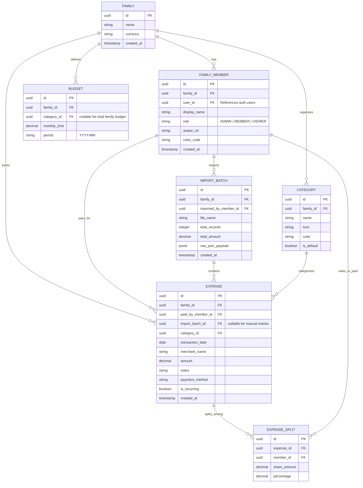

# 👨‍👩‍👧‍👦 Family Expense Management App (MVP) — Design & Architecture Document

## 1. Executive Summary & Vision

The **Family Expense Management App** is a modern, cross-platform solution (iOS, Android, and Web) built with **React Native (Expo)** and **Supabase (PostgreSQL)** designed to streamline household financial tracking and budget analytics.

For this **MVP (Minimum Viable Product)**, data ingestion is streamlined to **structured JSON statement imports**. Each family member can upload their structured JSON expense reports. The app immediately validates, categorizes, and indexes the expenses, providing the whole family with actionable financial intelligence through sleek, interactive, and informative charts with real-time multi-device sync.

### MVP Core Value Propositions

- **Instant JSON Ingestion:** Fast, deterministic import of structured transaction files (`.json`) with automated schema validation and duplicate detection.
- **Collaborative Family Ledger:** Unified visibility into household finances with real-time multi-device synchronization, per-member attribution, shared expense splitting, and role-based permissions via Supabase PostgreSQL.
- **Rich Visual Analytics:** Dynamic, tactile charts and financial indicators powered by PostgreSQL analytical aggregations, delivering instant budget insights, spending trends, and category breakdowns.
- **True Cross-Platform Experience:** Seamless UX across Mobile (iOS/Android via Expo) and Desktop/Tablet Web with responsive layouts.

---

## 2. Information Architecture & Navigation

The app is built on **Expo Router** using a unified layout structure that dynamically adapts between a bottom navigation bar on mobile and a side navigation drawer / rail on tablet and web.

```mermaid
graph TD
    App[Family Expense App] --> Auth[Auth & Family Onboarding]
    App --> Shell[App Navigation Shell]

    Shell --> Tab1[📊 Dashboard]
    Shell --> Tab2[📈 Analytics & Insights]
    Shell --> Tab3[💳 Expense Ledger]
    Shell --> Tab4[📥 Import & Export]
    Shell --> Tab5[⚙️ Family & Budgets]

    Tab1 --> QuickImport[Quick JSON Import Modal]
    Tab1 --> SummaryCards[Summary KPI Cards]
    Tab1 --> MemberRings[Member Spending Rings]
    Tab1 --> RecentTx[Recent Transactions]

    Tab2 --> CatBreakdown[Category Donut / Sunburst]
    Tab2 --> MemberContrib[Member Stacked Bar Charts]
    Tab2 --> TrendTimeline[Monthly Cashflow / Trend Lines]
    Tab2 --> Comparison[Month-over-Month Comparative Analytics]

    Tab3 --> FilterDrawer[Filter & Search Engine]
    Tab3 --> TxDetails[Transaction Detail & Split View]
    Tab3 --> ManualEntry[Manual Add / Edit Expense]

    Tab4 --> JSONDropzone[JSON File Dropzone & Schema Validator]
    Tab4 --> ImportPreview[Batch Import Preview & Staging]
    Tab4 --> ExportCenter[Export Family Ledger to JSON/CSV]

    Tab5 --> BudgetPlanner[Category Budget Allocations]
    Tab5 --> MemberManagement[Family Member Profiles & Avatars]
```



---

## 3. Screen Breakdown & UI/UX Specifications

### 3.1 📊 Dashboard (Home)

- **Top Bar:** Active Family Selector, Month/Year date picker, User Avatar & Notification bell.
- **Hero KPI Cards:**
  - _Total Monthly Spend_ vs _Total Family Budget_ (with animated progress gauge / fill ring).
  - _Daily Average Burn Rate_ & _Projected End-of-Month Total_.
  - _Top Spending Category_ & Member Spend Leaderboard.
- **Member Carousel:** Horizontal scrollable cards for each family member showing their monthly contribution, avatar, and individual budget status.
- **Interactive Quick Chart:** Mini trend sparkline showing spending velocity compared to the same period last month.
- **Recent Expenses Feed:** Quick-action list with category iconography, member avatar badges, and swipe-to-edit actions.
- **Floating Action Button (FAB):** Quick trigger for "Import JSON File" or "Add Manual Expense".

### 3.2 📈 Analytics & Deep Insights

- **Time Controls:** Segmented control for `Week | Month | Quarter | Year | Custom Range`.
- **Chart 1: Spend Distribution by Category:**
  - High-res Donut chart with center total.
  - Interactive slices: tapping a slice filters downstream data and highlights top merchants.
- **Chart 2: Member Contribution & Share:**
  - Stacked bar chart or grouped column chart comparing member spend across top categories (e.g., Groceries, Utilities, Kids, Leisure).
- **Chart 3: Cashflow & Spending Velocity Timeline:**
  - Smooth Bézier curve / area chart plotting cumulative spending throughout the month with budget ceiling threshold line.
- **Chart 4: Heatmap / Calendar View:**
  - Visual calendar highlighting high-expense days to detect spending spikes (rent, insurance, bulk shopping).

### 3.3 💳 Expense Ledger & Management

- **Search & Multi-Dimensional Filters:** Filter by Member, Category, Date range, Payment Method, Amount, and Tag.
- **Transaction Item Display:**
  - Date, Merchant / Description, Category pill with custom color/icon, Member avatar badge, Amount (formatted by currency), Split indicator (if shared).
- **Transaction Detail Modal / Drawer:**
  - Split options (e.g. 50/50, custom ratio, or assigned to specific members).
  - Notes, tax deductibility flag, recurring status.

### 3.4 📥 Import & Export Center (JSON Ingestion)

- **Dropzone / Ingestion Zone:** Drag-and-drop JSON file on Web, Native File Picker on iOS & Android.
- **Sample JSON Template Download:** Button to download/copy the standard structured JSON schema.
- **Validation & Staging Review:**
  - Validates JSON format against the schema (checks for valid dates, positive amounts, valid categories).
  - Highlights duplicate warnings (transactions with identical date, merchant, and amount).
  - One-click batch commit: **"Confirm & Import (N Transactions)"**.
- **Export Engine:** One-click export of current filtered view or entire year to `.json` or `.csv`.

### 3.5 ⚙️ Family, Budgets & Settings

- **Family Group Settings:** Invite members via QR code or email link, assign roles (`Admin`, `Member`, `Viewer`).
- **Budget Thresholds:** Set overall family monthly budget + individual category envelopes (e.g., Groceries: $1,200/mo, Entertainment: $400/mo).
- **Custom Categories:** Add/edit custom categories with custom icons and colors.

---

## 4. MVP Standard JSON Specification

The app accepts structured JSON files following this clean, standardized schema:

```json
{
  "report_title": "August 2026 Credit Card Expenses",
  "statement_period": {
    "start_date": "2026-08-01",
    "end_date": "2026-08-31"
  },
  "currency": "EUR",
  "uploaded_by": "Berto",
  "expenses": [
    {
      "date": "2026-08-03",
      "merchant": "Trader Joe's",
      "amount": 84.5,
      "category": "Groceries",
      "notes": "Weekly household grocery run",
      "payment_method": "Credit Card",
      "is_recurring": false,
      "split": {
        "is_split": true,
        "type": "EQUAL",
        "members": ["Berto", "Partner"]
      }
    },
    {
      "date": "2026-08-05",
      "merchant": "Electric Utility Co",
      "amount": 112.3,
      "category": "Utilities",
      "notes": "Electricity bill",
      "payment_method": "Bank Transfer",
      "is_recurring": true
    }
  ]
}
```

### TypeScript Validation Schema (Zod)

```typescript
import { z } from 'zod';

export const ExpenseItemSchema = z.object({
  date: z.string().regex(/^\d{4}-\d{2}-\d{2}$/, 'Date must be in YYYY-MM-DD format'),
  merchant: z.string().min(1, 'Merchant name is required'),
  amount: z.number().positive('Amount must be greater than 0'),
  category: z.string().default('Uncategorized'),
  notes: z.string().optional(),
  payment_method: z.string().optional(),
  is_recurring: z.boolean().default(false),
  split: z
    .object({
      is_split: z.boolean().default(false),
      type: z.enum(['EQUAL', 'PERCENTAGE', 'EXACT']).default('EQUAL'),
      members: z.array(z.string()).optional(),
    })
    .optional(),
});

export const ExpenseReportImportSchema = z.object({
  report_title: z.string().optional(),
  statement_period: z
    .object({
      start_date: z.string().optional(),
      end_date: z.string().optional(),
    })
    .optional(),
  currency: z.string().default('EUR'),
  uploaded_by: z.string().optional(),
  expenses: z.array(ExpenseItemSchema).min(1, 'At least one expense is required'),
});
```

---

## 5. Frontend & Backend Architecture

```
┌────────────────────────────────────────────────────────────────────────┐
│               EXPO CLIENT (iOS / Android / Web)                        │
│   React Native (Typed StyleSheet & Design Tokens) | Reanimated | Charts│
└───────────────────────────────────┬────────────────────────────────────┘
                                    │ HTTPS (PostgREST) + WSS (Realtime)
┌───────────────────────────────────▼────────────────────────────────────┐
│                           SUPABASE PLATFORM                            │
│                                                                        │
│ ┌────────────────────────┐ ┌────────────────────────┐ ┌──────────────┐ │
│ │     SUPABASE AUTH      │ │   SUPABASE POSTGRES    │ │ JSON STORAGE │ │
│ │  - Email / Password    │ │  - Relational Tables   │ │  - Import log│ │
│ │  - Google / Apple Auth │ │  - Row Level Security  │ │  - Raw JSON  │ │
│ │  - Family Invite Tokens│ │  - Analytics Views/RPC │ │              │ │
│ └────────────────────────┘ └────────────────────────┘ └──────────────┘ │
│                                                                        │
│ ┌────────────────────────┐ ┌─────────────────────────────────────────┐ │
│ │   SUPABASE REALTIME    │ │       ANALYTICAL SQL FUNCTIONS          │ │
│ │  - Live ledger updates │ │  - get_family_monthly_summary()         │ │
│ │  - Instant chart sync  │ │  - get_category_breakdown()             │ │
│ └────────────────────────┘ └─────────────────────────────────────────┘ │
└────────────────────────────────────────────────────────────────────────┘
```

### 5.1 Frontend Tech Stack (No Tailwind)

- **Framework:** [Expo (SDK 52+)](https://expo.dev) + [React Native](https://reactnative.dev)
- **Routing:** [Expo Router](https://docs.expo.dev/router/introduction/) (typed file-based routing).
- **Styling System:** Native React Native `StyleSheet` paired with a **Centralized Design Token System** (`theme/colors.ts`, `theme/spacing.ts`, `theme/typography.ts`, `theme/shadows.ts`) and a dynamic `useTheme` hook supporting Dark and Light modes.
- **Icons:** [Lucide React Native](https://lucide.dev)
- **Animations:** React Native Reanimated
- **Charts:** [react-native-gifted-charts](https://gifted-charts.web.app/) & [Victory Native](https://formidable.com/open-source/victory-native/)
- **State Management:** Zustand + TanStack Query (React Query)
- **File Ingestion:** `expo-document-picker` + `expo-file-system`

---

## 6. Data Models & Entity Relationship Diagram (ERD)



---

## 7. UI/UX Design System & Polish

### 7.1 Design Tokens (`src/theme/`)

```typescript
export const Palette = {
  primary: {
    50: '#EEF2FF',
    100: '#E0E7FF',
    500: '#6366F1',
    600: '#4F46E5', // Brand Indigo
    900: '#1E1B4B', // Deep Slate
  },
  emerald: {
    500: '#10B981', // Positive / On track
    600: '#059669',
  },
  amber: {
    500: '#F59E0B', // Warnings / Near limit
  },
  rose: {
    500: '#F43F5E', // Exceeded / Alert
  },
  neutral: {
    50: '#F8FAFC',
    100: '#F1F5F9',
    200: '#E2E8F0',
    700: '#334155',
    800: '#1E293B',
    900: '#0F172A',
  },
};

export const Spacing = {
  xs: 4,
  sm: 8,
  md: 12,
  lg: 16,
  xl: 24,
  xxl: 32,
};

export const Radius = {
  sm: 6,
  md: 10,
  lg: 16,
  xl: 24,
  full: 9999,
};
```

### 7.2 Interaction Principles

- **Micro-interactions:** Smooth spring animations for chart toggles and bottom sheets.
- **Haptics:** Subtle haptic feedback on iOS/Android when confirming imports.
- **Responsive Layout:** Bottom bar on mobile; sidebar navigation + wide analytics canvas on tablet and web.

---

## 8. Phased Implementation Roadmap

1. **Phase 1: Project Scaffolding & Foundation**
   - Initialize Expo SDK 52 with TypeScript and Expo Router.
   - Set up custom typed Theme & Design Token system (`src/theme/`) with standard React Native `StyleSheet`.
   - Setup navigation layout and icon sets.
   - Configure Supabase client (`@supabase/supabase-js`) and mock fallback provider.

2. **Phase 2: Core UI System & Mock Data Flow**
   - Create reusable UI components (Card, Button, Badge, Modal, BottomSheet, Avatar, DateRangePicker).
   - Implement structured mock dataset with sample JSON import files.

3. **Phase 3: Interactive Dashboard & Chart Visualizations**
   - Implement Dashboard overview with dynamic KPI metrics and member spending carousels.
   - Build high-polish Analytics screens: Category Donut, Member Contribution Stacked Bars, Cashflow Area/Trend graphs.

4. **Phase 4: Expense Ledger & Transaction Management**
   - Build search, category filtering, multi-criteria sorting, and transaction detail drawer.
   - Implement Split Expense calculator and manual transaction entry.

5. **Phase 5: JSON Import & Validation Dropzone**
   - Build JSON file drag-and-drop / file picker interface with Zod schema validation.
   - Staging table review & batch commit to the ledger.
   - Sample JSON download and export center.

6. **Phase 6: Family Management, Budgets & Polishing**
   - Implement family member onboarding, budget limit envelopes, and push notifications.
