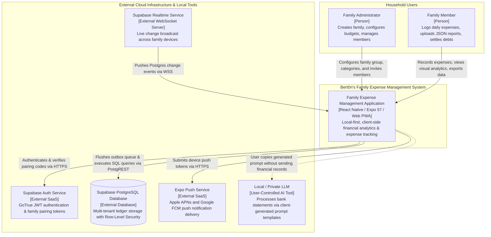
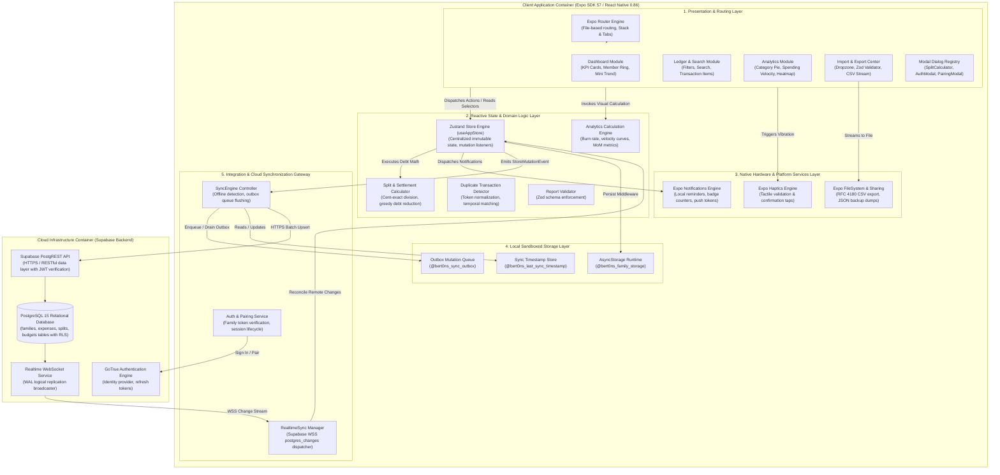

# C4 Architecture Model: Context & Container Topology

> **Module 01: Structural Decomposition & Container Architecture**  
> System: `Bert0n's Family Expense Management` | Standard: `C4 Model (Level 1 Context & Level 2 Containers)`

[← Previous: Index](./index.md) | [Index](./index.md) | [Next: Screens & Navigation →](./02-screens-and-navigation.md)

---

## 1. Executive Context & Architectural Boundaries

The **Family Expense Management System** operates as a hybrid client-cloud architecture. Its primary design imperative is **local-first autonomy**: the client application retains full operational capability without an active internet connection. Cloud infrastructure provided by Supabase serves as a synchronization and collaboration gateway rather than a mandatory runtime dependency.

---

## 2. C4 Level 1: System Context Diagram

The System Context diagram illustrates the system boundaries, primary human actors, external services, and data flow vectors.

### Context Boundary Descriptions

1. **Family Administrator & Members:**  
   Users interact with the application via mobile devices (iOS, Android) or desktop browsers (PWA). All members of a family share visibility into the family ledger, but administrative privileges (invitation management, category modifications) can be restricted via role policies (`ADMIN`, `MEMBER`, `VIEWER`).
2. **Local-First Client Instance:**  
   The primary computing engine is the client application itself. Financial math, chart aggregations, JSON parsing, and deduplication heuristics occur locally on the user's processor.
3. **Supabase Cloud Infrastructure:**  
   Provides relational persistence, role-based authorization via Row-Level Security (RLS), and sub-100ms multi-device event broadcasts through PostgreSQL replication channels.
4. **Local / Private LLM Ecosystem:**  
   Instead of uploading sensitive family statements to cloud AI APIs, the application provides an offline statement prompt generator. Users execute the prompt on their own local LLM (e.g. Ollama, Claude, ChatGPT web interface) and paste the sanitized JSON into the app.

---

## 3. C4 Level 2: Container Topology Diagram

The Container diagram decomposes the application into its logical runtimes, presentation modules, state management containers, local storage engines, and backend cloud nodes.

---

## 4. Container Responsibilities & Communication Contracts

### 4.1 Presentation & Routing Layer

- **Technology:** [Expo Router ^57.0.21](file:///home/berto/bert0ns-family-management/package.json#L21), React Native 0.86.3, React 19.2.3.
- **Responsibilities:** Renders the responsive UI shell across mobile screens and desktop viewports. Mounts the tab hierarchy (`/(tabs)`) and modal stack routes (`/expense/add`).
- **Communication Contract:** Consumes selectors from [`useAppStore`](file:///home/berto/bert0ns-family-management/src/services/store.ts#L152) and invokes pure functional calculation engines for chart visualizations.

### 4.2 Reactive State & Domain Logic Layer

- **Technology:** [Zustand ^5.0.15](file:///home/berto/bert0ns-family-management/package.json#L31), TypeScript ~6.0.3.
- **Responsibilities:** Maintains single-source-of-truth state for expenses, family members, categories, active filters, and outbox synchronization events.
- **Communication Contract:** Dispatches immutable state transitions, executes listeners registered via [`registerStoreMutationListener`](file:///home/berto/bert0ns-family-management/src/services/store.ts#L112-L125), and persists changes through AsyncStorage.

### 4.3 Integration & Synchronization Layer

- **Technology:** [`@supabase/supabase-js ^2.114.0`](file:///home/berto/bert0ns-family-management/package.json#L10).
- **Responsibilities:** Manages the offline-first queue ([`syncEngine`](file:///home/berto/bert0ns-family-management/src/services/syncEngine.ts#L36)), executes conflict resolution using Last-Write-Wins timestamps, and maintains the active WebSocket channel ([`realtimeSync`](file:///home/berto/bert0ns-family-management/src/services/realtimeSync.ts#L10)).
- **Communication Contract:** Communicates with Supabase using HTTPS REST (PostgREST) and WebSocket WSS (Supabase Realtime).

### 4.4 Local Sandboxed Storage Container

- **Technology:** [`@react-native-async-storage/async-storage 2.2.0`](file:///home/berto/bert0ns-family-management/package.json#L8), `expo-file-system`.
- **Responsibilities:** Persists local serialized state snapshots across app lifecycles, maintaining outbox mutation queues and temporary export files.
- **Communication Contract:** Asynchronous key-value I/O via native Android SQLite/SharedPreferences and iOS SQLite/NSUserDefaults bridges.

### 4.5 Cloud Backend Container (Supabase)

- **Technology:** PostgreSQL 15, GoTrue Auth, Realtime Server.
- **Responsibilities:** Provides centralized persistence for multi-device households, enforces Row-Level Security policies keyed to `family_id`, and emits change events to connected clients.
- **Communication Contract:** RFC 7519 JWT Bearer tokens passed via standard Authorization headers over TLS 1.3.

---

[← Previous: Index](./index.md) | [Index](./index.md) | [Next: Screens & Navigation →](./02-screens-and-navigation.md)
