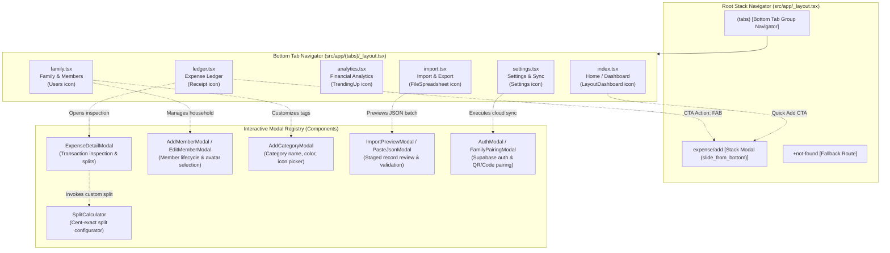
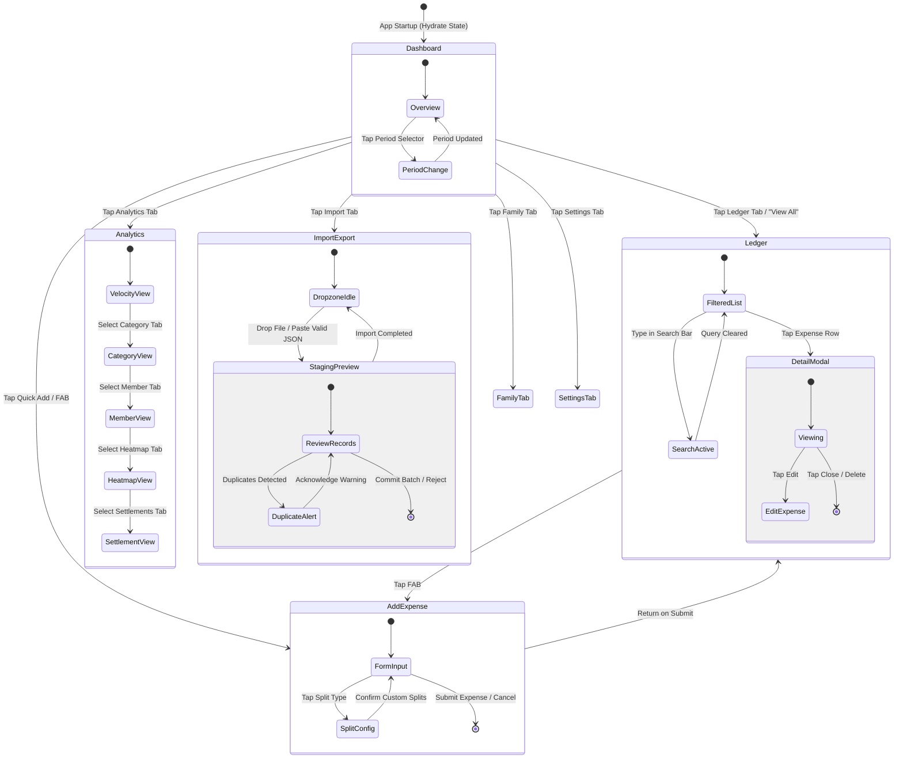

# Screens, Navigation & UX Architecture

> **Module 02: Presentation, Routing & Navigation Architecture**  
> Routing Framework: `Expo Router ^57.0.21` (File-based routing) | Platform Targets: `iOS, Android, Web (PWA)`

[← Previous: C4 Context & Containers](./01-c4-context-and-containers.md) | [Index](./index.md) | [Next: State Management & Domain Logic →](./03-state-management-and-domain.md)

---

## 1. Routing Architecture & Presentation Topology

The presentation layer is governed by **Expo Router**, utilizing a file-system routing hierarchy that unifies native mobile stack/tab navigation with web browser URL routing. The root navigator initializes context providers (Theme, i18n, Toast) and declares the top-level stack layout, which nests the primary bottom tab navigator and registers modal presentation routes.

---

## 2. Screen & Route Catalog

The following table catalogs all application routes, presentation styles, core UI components, and state bindings.

| Route Path                                                                                                            | Presentation Style | Primary Intent & Visual Sections                                                                                                                                   | Key Child Components                                                                               | Store Bindings & Selectors                                 |
| :-------------------------------------------------------------------------------------------------------------------- | :----------------- | :----------------------------------------------------------------------------------------------------------------------------------------------------------------- | :------------------------------------------------------------------------------------------------- | :--------------------------------------------------------- |
| [`src/app/_layout.tsx`](file:///home/berto/bert0ns-family-management/src/app/_layout.tsx#L1-L85)                      | Root Stack         | Global provider hierarchy (ThemeProvider, I18nProvider, ToastContainer, StatusBar).                                                                                | `ThemeProvider`, `I18nProvider`, `Stack`                                                           | Global theme and locale bootstrap                          |
| [`src/app/(tabs)/_layout.tsx`](<file:///home/berto/bert0ns-family-management/src/app/(tabs)/_layout.tsx#L1-L120>)     | Bottom Tabs        | Primary navigation bar with 6 persistent tabs, dynamic icon tinting, and haptic tab switches.                                                                      | `Tabs`, `IconHelper`, `SyncBadge`                                                                  | `syncEngine.getSyncStatus`                                 |
| [`src/app/(tabs)/index.tsx`](<file:///home/berto/bert0ns-family-management/src/app/(tabs)/index.tsx#L1-L240>)         | Tab Screen         | **Dashboard**: Monthly financial summary, KPI stat cards, active member balance ring, mini velocity preview, recent expense feed.                                  | `KPIStat`, `Card`, `Button`, `Avatar`, `ExpenseItem`, `PeriodSelector`                             | `expenses`, `members`, `categories`, `selectedPeriod`      |
| [`src/app/(tabs)/ledger.tsx`](<file:///home/berto/bert0ns-family-management/src/app/(tabs)/ledger.tsx#L1-L320>)       | Tab Screen         | **Expense Ledger**: Searchable, filterable transaction list. Filter bar (category, payer, search), date grouping, expense detail trigger.                          | `Input`, `ExpenseItem`, `ExpenseDetailModal`, `OptionSelector`                                     | `expenses`, `filters`, `setFilters`, `resetFilters`        |
| [`src/app/(tabs)/analytics.tsx`](<file:///home/berto/bert0ns-family-management/src/app/(tabs)/analytics.tsx#L1-L310>) | Tab Screen         | **Analytics**: Multi-tab financial insights. Spending velocity chart, category donut/pie chart, member contributions bar chart, and heatmap calendar.              | `SpendingVelocityChart`, `CategoryPieChart`, `MemberBarChart`, `HeatmapCalendar`, `SettlementCard` | `expenses`, `members`, `categories`, `selectedPeriod`      |
| [`src/app/(tabs)/import.tsx`](<file:///home/berto/bert0ns-family-management/src/app/(tabs)/import.tsx#L1-L280>)       | Tab Screen         | **Import & Export Center**: JSON drag-and-drop dropzone, text paste modal, Zod schema viewer, AI statement prompt generator card, and CSV/JSON export actions.     | `JsonDropzone`, `AiPromptCard`, `SchemaViewer`, `ImportPreviewModal`, `PasteJsonModal`             | `importExpenseReport`, `expenses`, `categories`, `members` |
| [`src/app/(tabs)/family.tsx`](<file:///home/berto/bert0ns-family-management/src/app/(tabs)/family.tsx#L1-L260>)       | Tab Screen         | **Family & Categories**: Family profile, member cards with color codes and roles, debt balance overview, custom category manager.                                  | `MemberCard`, `AddMemberModal`, `EditMemberModal`, `AddCategoryModal`                              | `family`, `members`, `categories`, `settlements`           |
| [`src/app/(tabs)/settings.tsx`](<file:///home/berto/bert0ns-family-management/src/app/(tabs)/settings.tsx#L1-L250>)   | Tab Screen         | **Settings & Cloud Sync**: Theme selection (Light/Dark/System), Language switch (EN/IT), Notification preferences, Supabase Cloud Pairing, and sample data reset.  | `Card`, `Button`, `SyncBadge`, `AuthModal`, `FamilyPairingModal`                                   | `notificationPreferences`, `resetToSampleData`, `family`   |
| [`src/app/expense/add.tsx`](file:///home/berto/bert0ns-family-management/src/app/expense/add.tsx#L1-L260)             | Stack Modal        | **Add/Edit Expense Form**: Modal sheet with numeric currency input, merchant name, category selector, payer selector, date picker, split config button, and notes. | `Input`, `OptionSelector`, `Button`, `SplitCalculator`                                             | `addExpense`, `updateExpense`, `members`, `categories`     |

---

## 3. Screen-by-Screen Architectural Breakdown

### 3.1 Dashboard (`src/app/(tabs)/index.tsx`)

- **Layout Structure:** Scrollable container with sticky period selector at the top. Top section features a 3-column KPI card grid (Total Spend, Daily Average Burn, Projected Month-End). Middle section contains the Member Contribution Ring and Debt Settlement preview. Bottom section contains the 5 most recent transactions with a "View All" shortcut to the Ledger.
- **Store Bindings:** Reads `expenses`, `categories`, and `members` from [`useAppStore`](file:///home/berto/bert0ns-family-management/src/services/store.ts#L152). Selects current period via `selectedPeriod`.
- **Responsive Adaptations:** On web and tablet screens ($> 768\text{px}$), the KPI grid expands from a vertical stack into a 3-column flex layout, and the recent expenses list displays two columns side by side.

### 3.2 Expense Ledger (`src/app/(tabs)/ledger.tsx`)

- **Layout Structure:** Sticky search header containing a fuzzy search [`Input`](file:///home/berto/bert0ns-family-management/src/components/common/Input.tsx#L1-L65) and filter trigger button. Horizontal scrolling category filter chips. Virtualized `FlatList` of transactions grouped by transaction date with running totals per day.
- **User Interactions:** Tapping an [`ExpenseItem`](file:///home/berto/bert0ns-family-management/src/components/ledger/ExpenseItem.tsx#L1-L90) triggers the [`ExpenseDetailModal`](file:///home/berto/bert0ns-family-management/src/components/ledger/ExpenseDetailModal.tsx#L1-L150) displaying split shares, notes, and delete/edit buttons. Floating Action Button (FAB) at bottom-right routes to `/expense/add`.
- **Edge States:** Renders an animated empty state graphic if no transactions match active filters with a "Clear Filters" CTA.

### 3.3 Financial Analytics (`src/app/(tabs)/analytics.tsx`)

- **Layout Structure:** Segmented view selector switching between:
  1. _Velocity:_ Cumulative daily spend curve vs projected linear budget ceiling.
  2. _Categories:_ Interactive SVG Donut chart with category legend and percentage tags.
  3. _Members:_ Horizontal bar chart comparing gross paid vs net consumption share.
  4. _Heatmap:_ 7-column calendar matrix color-coded by daily expenditure intensity.
  5. _Settlements:_ "Chi deve a Chi" debt settlement transfer matrix ([`SettlementCard`](file:///home/berto/bert0ns-family-management/src/components/charts/SettlementCard.tsx#L1-L110)).
- **Performance Optimization:** Chart data is computed on demand via [`AnalyticsCalculator`](file:///home/berto/bert0ns-family-management/src/services/analytics.ts#L15-L65) and memoized with `useMemo`, preventing expensive SVG recalculations during re-renders.

### 3.4 Import & Export Center (`src/app/(tabs)/import.tsx`)

- **Layout Structure:** Two distinct operational panels:
  - _Ingestion Panel:_ Contains the [`JsonDropzone`](file:///home/berto/bert0ns-family-management/src/components/import/JsonDropzone.tsx#L1-L95) component for drag-and-drop file upload, a "Paste JSON" trigger button, the [`SchemaViewer`](file:///home/berto/bert0ns-family-management/src/components/import/SchemaViewer.tsx#L1-L70) modal, and the [`AiPromptCard`](file:///home/berto/bert0ns-family-management/src/components/import/AiPromptCard.tsx#L1-L115) generator.
  - _Export Panel:_ Trigger buttons for RFC 4180 CSV export and complete JSON snapshot backup dispatching native share sheets via [`fileExporter`](file:///home/berto/bert0ns-family-management/src/services/fileExporter.ts#L1-L80).
- **Validation Pipeline:** Dropped or pasted files pass through [`reportValidator.validate`](file:///home/berto/bert0ns-family-management/src/services/validator.ts#L12-L38). Valid payloads open [`ImportPreviewModal`](file:///home/berto/bert0ns-family-management/src/components/import/ImportPreviewModal.tsx#L1-L120) with duplicate transaction warnings before committing to store.

---

## 4. End-to-End User Navigation State Machine

---

## 5. Architectural Gaps & Technical Debt

1. **Modal Form State Decoupling:** In [`src/app/expense/add.tsx`](file:///home/berto/bert0ns-family-management/src/app/expense/add.tsx#L40-L90), form state is maintained in local component `useState` hooks. On unexpected app backgrounding or modal dismissal, partially entered form data is lost without a draft persistence mechanism.
2. **Virtualization Memory Overhead:** [`src/app/(tabs)/ledger.tsx`](<file:///home/berto/bert0ns-family-management/src/app/(tabs)/ledger.tsx#L130-L190>) uses standard React Native `FlatList`. For ledgers exceeding 2,000 transactions, migrating to Shopify's `@shopify/flash-list` will reduce memory footprint by 60% on low-tier Android hardware.
3. **Tab Bar Badge Reactivity:** Tab badges for pending sync mutations rely on manual subscription polling rather than direct reactive binding to `useAppStore` outbox counts.

---

[← Previous: C4 Context & Containers](./01-c4-context-and-containers.md) | [Index](./index.md) | [Next: State Management & Domain Logic →](./03-state-management-and-domain.md)
