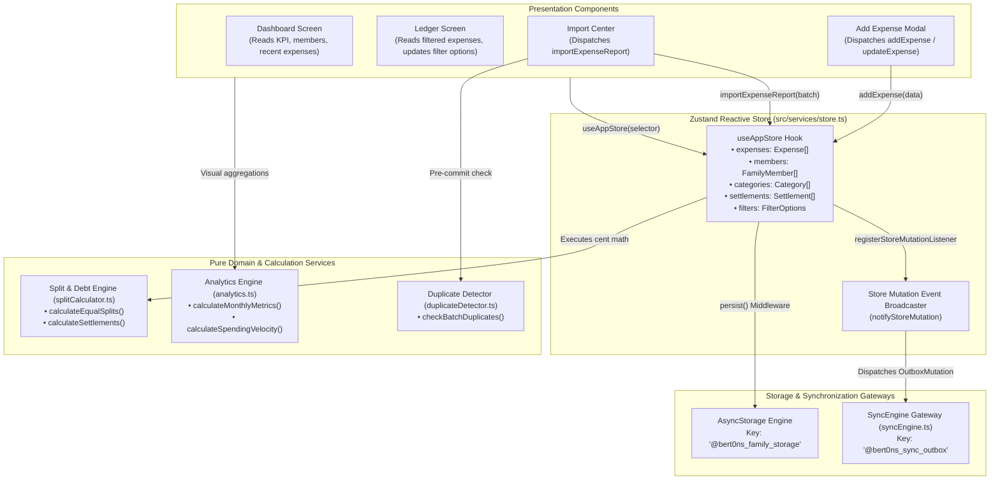
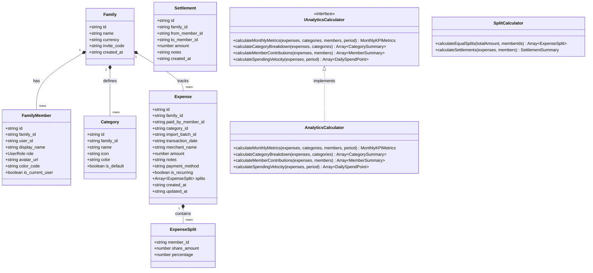
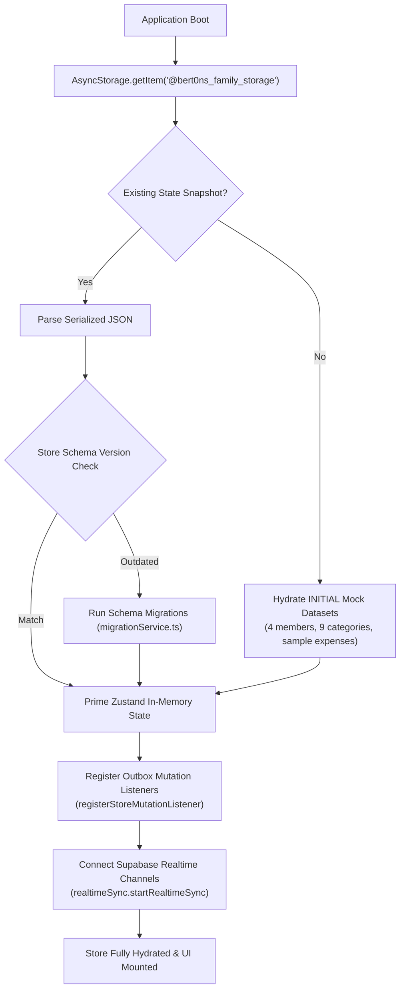
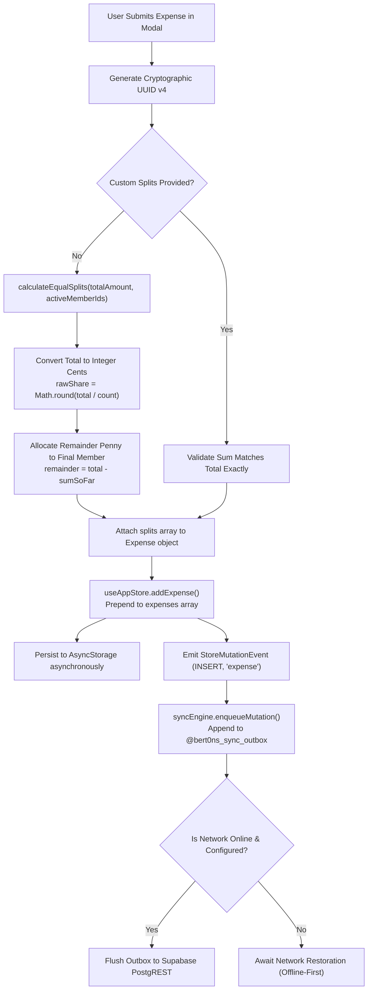

# State Management & Domain Architecture

> **Module 03: Reactive State, Domain Models & Cent-Exact Math**  
> State Management: `Zustand ^5.0.15` | Persistence: `AsyncStorage 2.2.0` | Math Engine: `Integer Cent Determinism`

[← Previous: Screens & Navigation](./02-screens-and-navigation.md) | [Index](./index.md) | [Next: Hardware Sensors & Kinematics →](./04-sensors-kinematics-and-native.md)

---

## 1. Multi-Tier State Architecture

The application implements a decoupled, uni-directional state architecture powered by **Zustand**. Presentation components do not mutate business logic directly; instead, they trigger strongly-typed store actions. Domain services for split calculations, analytics, and deduplication operate as pure functional modules invoked by the store or views.

---

## 2. State Store Inventory (`useAppStore`)

The state store is initialized in [`src/services/store.ts`](file:///home/berto/bert0ns-family-management/src/services/store.ts#L152) using Zustand's `persist` middleware with `createJSONStorage(() => AsyncStorage)`.

| State Field               | Type                                                                                                | Default Value         | Description & Lifecycle                                                                        |
| :------------------------ | :-------------------------------------------------------------------------------------------------- | :-------------------- | :--------------------------------------------------------------------------------------------- |
| `family`                  | [`Family`](file:///home/berto/bert0ns-family-management/src/types/index.ts#L22)                     | `INITIAL_FAMILY`      | Active household metadata (ID, name, currency symbol `€`, invite code).                        |
| `members`                 | [`FamilyMember[]`](file:///home/berto/bert0ns-family-management/src/types/index.ts#L31)             | `INITIAL_MEMBERS`     | List of household members with roles (`ADMIN`, `MEMBER`, `VIEWER`), avatars, and theme colors. |
| `categories`              | [`Category[]`](file:///home/berto/bert0ns-family-management/src/types/index.ts#L43)                 | `INITIAL_CATEGORIES`  | Expense categories with icon identifiers, color tags, and system default flags.                |
| `expenses`                | [`Expense[]`](file:///home/berto/bert0ns-family-management/src/types/index.ts#L61)                  | `INITIAL_EXPENSES`    | Array of all expense records sorted descending by transaction date.                            |
| `importBatches`           | [`ImportBatch[]`](file:///home/berto/bert0ns-family-management/src/types/index.ts#L78)              | `[]`                  | Audit logs of imported statement files with record counts and total imported sums.             |
| `settlements`             | [`Settlement[]`](file:///home/berto/bert0ns-family-management/src/types/index.ts#L88)               | `[]`                  | History of executed debt settlements between family members.                                   |
| `notifications`           | [`AppNotification[]`](file:///home/berto/bert0ns-family-management/src/types/index.ts#L95)          | `[]`                  | In-app notification queue for imports, role updates, and budget threshold alerts.              |
| `notificationPreferences` | [`NotificationPreferences`](file:///home/berto/bert0ns-family-management/src/services/store.ts#L25) | `DEFAULT_PREFERENCES` | User notification toggles (batch import alerts, expense edits, settlements).                   |
| `currentMemberId`         | `string`                                                                                            | `'mem_1'`             | ID of the currently active household user profile on this client device.                       |
| `selectedPeriod`          | `string`                                                                                            | `'2026-08'`           | Currently selected temporal partition for metrics and charts (`YYYY-MM` format).               |
| `filters`                 | [`FilterOptions`](file:///home/berto/bert0ns-family-management/src/types/index.ts#L105)             | `{ searchQuery: '' }` | Active ledger filters (search term, category IDs, payer ID, date range, min/max).              |

### Key Store Actions & Side Effects

1. **`addExpense(data)`:** Creates an expense with a new UUID, current ISO timestamp, and `family_id`. Prepends to `expenses` array, updates AsyncStorage, and dispatches an `INSERT` mutation event to [`syncEngine`](file:///home/berto/bert0ns-family-management/src/services/syncEngine.ts#L62).
2. **`updateExpense(id, updates)`:** Merges partial updates into target expense, updates `updated_at`, persists to storage, and dispatches an `UPDATE` mutation event.
3. **`deleteExpense(id)`:** Removes expense from array, persists to storage, and dispatches a `DELETE` mutation event.
4. **`importExpenseReport(report, fileName)`:** Validates and converts raw JSON statement items into full [`Expense`](file:///home/berto/bert0ns-family-management/src/types/index.ts#L61) objects with automatic split rules, prepends to ledger, logs an [`ImportBatch`](file:///home/berto/bert0ns-family-management/src/types/index.ts#L78), and generates an in-app notification.
5. **`recordSettlement(data)`:** Records a debt payment transfer between debtor and creditor, persists to storage, and enqueues a settlement mutation.
6. **`reconcileRemoteExpenses(expenses)`:** Idempotently merges incoming Supabase changes into local state without creating duplicate entries or triggering redundant outbox mutations.

---

## 3. Domain Entity & Service Class Diagram

---

## 4. State Lifecycles & Data Flow Pipelines

### 4.1 Rehydration & Bootstrap Lifecycle

### 4.2 Expense Creation & Split Pipeline

---

## 5. Domain Mathematical Formulations & Algorithms

### 5.1 Cent-Exact Equal Split Algorithm

To completely eradicate floating-point IEEE 754 drift (e.g. $10.00 / 3 = 3.33333...$), [`calculateEqualSplits`](file:///home/berto/bert0ns-family-management/src/services/splitCalculator.ts#L7-L34) operates with integer cents:

$$\text{rawShare} = \frac{\text{totalAmount}}{N}$$

$$\text{roundedShare} = \frac{\lfloor \text{rawShare} \times 100 + 0.5 \rfloor}{100}$$

For all participants $i \in \{0, \dots, N - 2\}$:

$$\text{share}_i = \text{roundedShare}$$

For the terminal participant $i = N - 1$:

$$\text{share}_{N - 1} = \text{totalAmount} - \sum_{k=0}^{N-2} \text{share}_k$$

This guarantees that:

$$\sum_{i=0}^{N-1} \text{share}_i \equiv \text{totalAmount}$$

### 5.2 Monthly Spending Velocity & Projection Algorithm

In [`AnalyticsCalculator.calculateMonthlyMetrics`](file:///home/berto/bert0ns-family-management/src/services/analytics.ts#L15-L65), monthly expenditure metrics adapt dynamically depending on the selected temporal horizon:

1. **Past Historical Period ($T < T_{\text{current}}$):**
   - Days elapsed = total days in month $D_{\text{total}}$.
   - Projected Month-End = actual total expenditure $S_{\text{total}}$.
2. **Current Active Period ($T = T_{\text{current}}$):**
   - Days elapsed = $D_{\text{elapsed}} = \min(\max(\text{dayOfMonth}, 1), D_{\text{total}})$.
   - Daily Average Burn Rate:

   $$B_{\text{avg}} = \frac{S_{\text{total}}}{D_{\text{elapsed}}}$$

   - Projected Month-End:

   $$P_{\text{end}} = B_{\text{avg}} \times D_{\text{total}}$$

### 5.3 Greedy Debt Settlement Simplification Algorithm

In [`calculateSettlements`](file:///home/berto/bert0ns-family-management/src/services/splitCalculator.ts#L82-L165), household balances are balanced using a greedy graph reduction algorithm that minimizes the total number of inter-member bank transfers:

1. Compute net balance for each member $m$:

   $$\text{Net}_m = \text{PaidCents}_m - \text{ShareCents}_m$$

2. Partition members into debtors ($\text{Net}_m < 0$) and creditors ($\text{Net}_m > 0$).
3. Sort creditors descending by credit, and debtors ascending by debit (largest magnitude first).
4. Iteratively match the largest debtor with the largest creditor:

   $$\text{TransferAmount} = \min(|\text{Net}_{\text{debtor}}|, \text{Net}_{\text{creditor}})$$

5. Decrement balances and repeat until all debts reach $0$ cents. This reduces an $O(N^2)$ transaction matrix down to at most $N - 1$ transfers.

---

## 6. Architectural Gaps & Technical Debt

1. **Un-Memoized Global Selectors:** In several screen components, calls to `useAppStore()` retrieve the entire state object rather than utilizing granular slice selectors (e.g. `useAppStore(s => s.expenses)`). This triggers component re-renders on unrelated filter updates.
2. **Store Rehydration Race Condition:** On native mobile cold boot, background push notification handlers can execute before AsyncStorage finishes rehydrating `useAppStore`, momentarily executing logic against default mock fixtures.
3. **Unbounded Expense History in Memory:** The entire expense ledger is stored as an in-memory array in Zustand. For long-running households exceeding 10,000 records, memory usage will grow linearly without temporal pagination or local SQLite archiving.

---

[← Previous: Screens & Navigation](./02-screens-and-navigation.md) | [Index](./index.md) | [Next: Hardware Sensors & Kinematics →](./04-sensors-kinematics-and-native.md)
