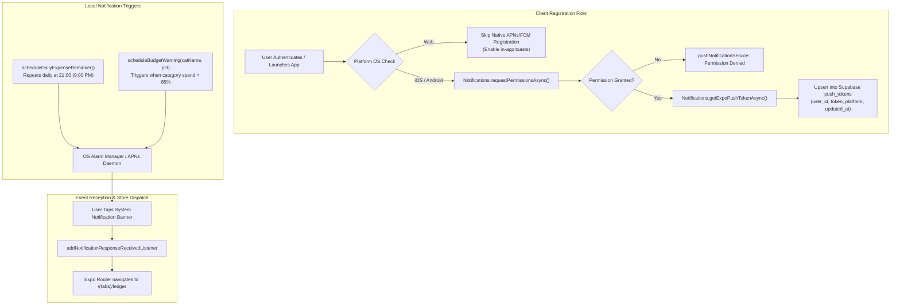
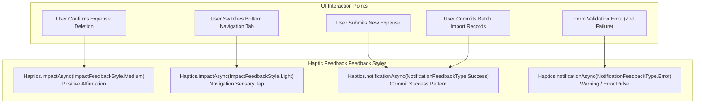
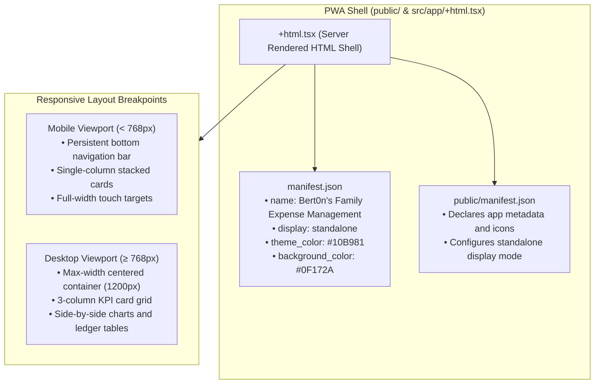

# Hardware Sensors, Native Subsystems & Platform Capabilities

> **Module 04: Native Runtime Bridges, Notifications & Platform APIs**  
> Ecosystem: `Expo SDK 57 / React Native 0.86` | Platforms: `iOS, Android, Web (PWA)`

[← Previous: State Management & Domain Logic](./03-state-management-and-domain.md) | [Index](./index.md) | [Next: External APIs & Networking →](./05-apis-networking-and-proxy.md)

---

## 1. Native Platform Capabilities Specification Matrix

The application leverages cross-platform native hardware abstractions provided by Expo. On native mobile platforms (iOS and Android), these modules invoke compiled Objective-C/Swift and Java/Kotlin APIs; on the web platform, they gracefully degrade to modern HTML5 and W3C Web APIs.

| Platform Capability            | Native Package                                                                                 | Mobile Target (iOS / Android)                                  | Web Platform Target (PWA)                                        | Permissions / Configuration                                   |
| :----------------------------- | :--------------------------------------------------------------------------------------------- | :------------------------------------------------------------- | :--------------------------------------------------------------- | :------------------------------------------------------------ |
| **Push & Local Notifications** | [`expo-notifications ~0.32.16`](file:///home/berto/bert0ns-family-management/package.json#L18) | APNs / FCM daemon, local OS alarms, badge counters.            | No-op fallback; web push handled via Service Worker.             | `POST_NOTIFICATIONS` on Android 13+; User prompt on iOS.      |
| **File System Sandboxing**     | [`expo-file-system ~19.0.21`](file:///home/berto/bert0ns-family-management/package.json#L17)   | App cache sandbox (`FileSystem.cacheDirectory`).               | In-memory Blobs and temporary `BlobProvider` URLs.               | Sandboxed directory access (no runtime permissions required). |
| **Native Share Sheet**         | [`expo-sharing ~14.0.8`](file:///home/berto/bert0ns-family-management/package.json#L24)        | iOS `UIActivityViewController` / Android Intent `ACTION_SEND`. | W3C Web Share API (`navigator.share`) or `<a>` download trigger. | None (user-initiated OS intent).                              |
| **Haptic Feedback Engine**     | [`expo-haptics ~15.0.8`](file:///home/berto/bert0ns-family-management/package.json#L19)        | iOS Taptic Engine / Android Vibrator service.                  | W3C `navigator.vibrate` (when supported by browser).             | `android.permission.VIBRATE` (automatically merged).          |
| **System Clipboard Bridge**    | [`expo-clipboard ~8.0.7`](file:///home/berto/bert0ns-family-management/package.json#L16)       | Native `UIPasteboard` / `ClipboardManager`.                    | W3C Async Clipboard API (`navigator.clipboard`).                 | Explicit user gesture context on web.                         |
| **Web Shell & PWA Manifest**   | Manifest [](file:///home/berto/bert0ns-family-management/public/manifest.json#L1-L30)          | N/A (Embedded React Native Native View).                       | Standalone PWA web shell, manifest configuration.                | Web App Manifest registered in .                              |

---

## 2. Notification Architecture & Event Pipeline

The notification subsystem ([`src/services/pushNotificationService.ts`](file:///home/berto/bert0ns-family-management/src/services/pushNotificationService.ts#L1-L150)) coordinates both remote cloud push notifications and scheduled local alarms.

### 2.1 Foreground Presentation Configuration

On native mobile devices, foreground notifications are intercepted and configured to present visual banners and auditory cues without disrupting active screens:

```typescript
if (Platform.OS !== 'web') {
  Notifications.setNotificationHandler({
    handleNotification: async () => ({
      shouldShowAlert: true,
      shouldPlaySound: true,
      shouldSetBadge: false,
      shouldShowBanner: true,
      shouldShowList: true,
    }),
  });
}
```

### 2.2 Notification Event Lifecycle



---

## 3. File System Sandboxing & Document Export Architecture

Exporting financial ledgers requires streaming RFC 4180 CSV files or complete JSON snapshots from in-memory state out to the user's local operating system.

```mermaid
flowchart TB
    subgraph ExportInitiation ["User Export Request"]
        LedgerExportCTA["User Taps 'Export CSV' in Import/Export Tab"]
        BackupExportCTA["User Taps 'Export JSON Backup'"]
    end

    subgraph GenerationPipeline ["Client Generation Engine"]
        LedgerExportCTA --> CSVFormat["csvExporter.exportExpensesToCsv(expenses, categories, members)"]
        CSVFormat --> ValidateRFC["Enforce RFC 4180 Escaping<br/>(Escape commas, quotes, CRLF)"]

        BackupExportCTA --> JSONFormat["fileExporter.exportFamilyBackup(state)"]
        JSONFormat --> BundleState["Serialize Family, Members, Categories, Expenses"]
    end

    subgraph StorageAndDispatch ["Platform Storage & Share Dispatch"]
        ValidateRFC --> PlatformBranch{"Platform OS Check"}
        BundleState --> PlatformBranch

        PlatformBranch -->|Native iOS / Android| WriteSandbox["FileSystem.writeAsStringAsync()<br/>Write to cacheDirectory/export_*.csv"]
        WriteSandbox --> VerifyShareAvailable{"Sharing.isAvailableAsync()"}
        VerifyShareAvailable -->|True| OpenShareSheet["Sharing.shareAsync(fileUri)<br/>Display iOS UIActivity / Android Send Intent"]
        VerifyShareAvailable -->|False| NativeFallback["Notify user: Sharing unavailable"]

        PlatformBranch -->|Web PWA Browser| CreateBlob["new Blob("[content], { type: 'text/csv' }")"]
        CreateBlob --> GenerateObjectURL["URL.createObjectURL(blob)"]
        GenerateObjectURL --> TriggerDownloadAnchor["Create hidden <a> element & trigger .click()"]
        TriggerDownloadAnchor --> RevokeURL["URL.revokeObjectURL(url)"]
    end
```

---

## 4. Haptic Feedback Topology

Tactile sensations are integrated across key user interactions to provide physical confirmation and prevent erroneous financial inputs via [`expo-haptics`](file:///home/berto/bert0ns-family-management/package.json#L19).



---

## 5. Progressive Web App (PWA) & Web Shell Architecture

For web environments, the application is bundled as a Progressive Web App capable of standalone installation on desktop and mobile browsers.



---

## 6. Architectural Gaps & Technical Debt

1. **Service Worker Caching Infrastructure:** Web deployment relies on HTTP cache headers on [`public/index.html`](file:///home/berto/bert0ns-family-management/public/index.html#L1-L30) and static assets without a dedicated offline service worker caching tier.
2. **Web Push Notification Integration:** Push notifications currently rely solely on Expo's APNs/FCM proxy. On the Web platform, native Web Push (VAPID / W3C Push API) is not currently connected to Supabase triggers.
3. **Export Cache Cleanup:** Exported temporary CSV and JSON files in `FileSystem.cacheDirectory` are not purged after native share dismissal, leading to disk space consumption over extended usage periods.

---

[← Previous: State Management & Domain Logic](./03-state-management-and-domain.md) | [Index](./index.md) | [Next: External APIs & Networking →](./05-apis-networking-and-proxy.md)
