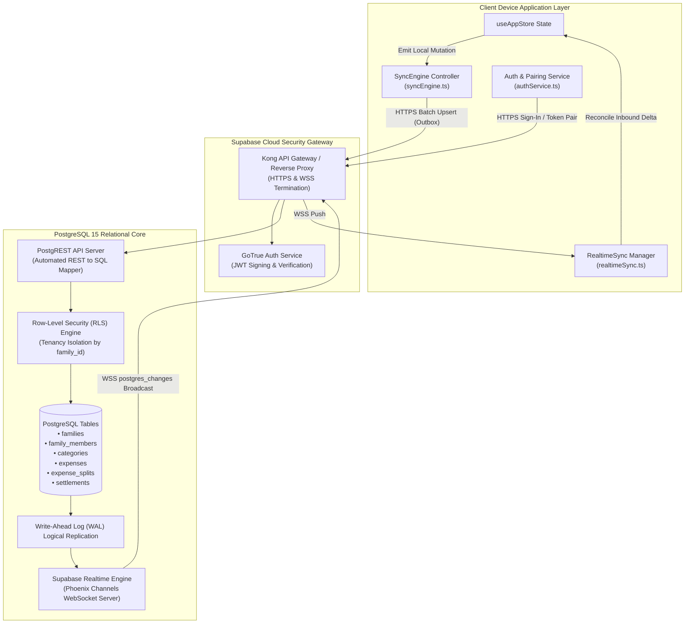
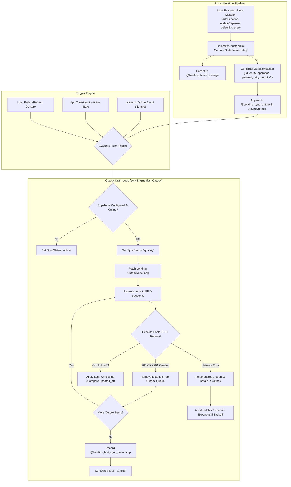
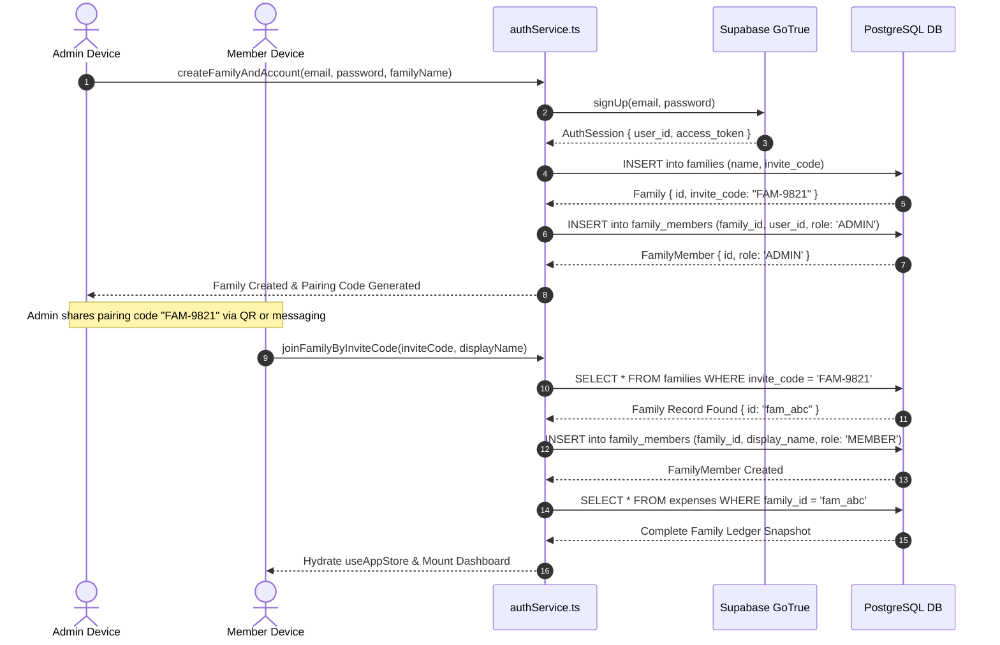
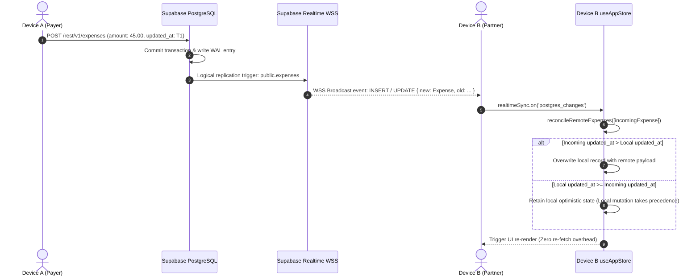
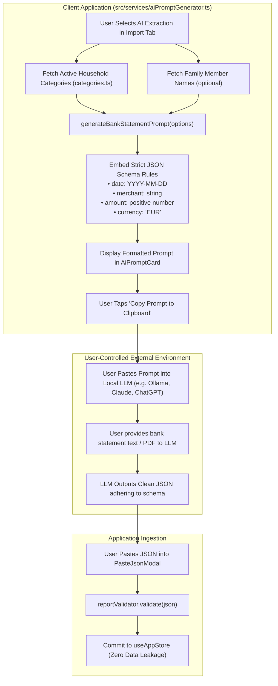

# External APIs, Networking & Cloud Architecture

> **Module 05: Cloud Infrastructure, PostgreSQL RLS & Offline Synchronization**  
> Backend Provider: `Supabase (PostgreSQL 15, PostgREST, GoTrue Auth, Realtime WSS)`

[← Previous: Hardware Sensors & Kinematics](./04-sensors-kinematics-and-native.md) | [Index](./index.md) | [Next: Cross-Cutting Concerns →](./06-cross-cutting-concerns.md)

---

## 1. Network & Backend Topology Diagram

The backend infrastructure is anchored by Supabase's hosted PostgreSQL engine. The client application connects via two distinct channels: an HTTPS RESTful gateway (PostgREST) for transactional batch mutations and an authenticated WebSocket pipeline for real-time change data capture.



---

## 2. Database Schema & Multi-Tenant RLS Policy Catalog

The complete relational schema is declared in [`src/data/supabase_schema.sql`](file:///home/berto/bert0ns-family-management/src/data/supabase_schema.sql#L1-L220). Multi-tenancy is enforced strictly at the database engine level via PostgreSQL Row-Level Security (RLS).

### 2.1 Entity Relationship Catalog

| Table Name       | Primary Key | Foreign Keys                                                       | Indexing & Constraints                   | Purpose & Lifecycle                                                     |
| :--------------- | :---------- | :----------------------------------------------------------------- | :--------------------------------------- | :---------------------------------------------------------------------- |
| `families`       | `id (UUID)` | None                                                               | `invite_code (UNIQUE)`                   | Root household container; defines shared currency (`€`).                |
| `family_members` | `id (UUID)` | `family_id` → `families.id`, `user_id` → `auth.users.id`           | `role IN ('ADMIN', 'MEMBER', 'VIEWER')`  | Household member profiles with custom display names and color codes.    |
| `categories`     | `id (UUID)` | `family_id` → `families.id`                                        | `family_id, name`                        | Expense categories with icons and color tags.                           |
| `budgets`        | `id (UUID)` | `family_id` → `families.id`, `category_id` → `categories.id`       | `UNIQUE(family_id, category_id, period)` | Monthly spending ceilings per category and temporal period (`YYYY-MM`). |
| `expenses`       | `id (UUID)` | `family_id`, `paid_by_member_id`, `category_id`, `import_batch_id` | `INDEX(family_id, transaction_date)`     | Core expense ledger; records amount, merchant, date, and notes.         |
| `expense_splits` | `id (UUID)` | `expense_id` → `expenses.id`, `member_id` → `family_members.id`    | `CASCADE DELETE` on expense deletion     | Cent-exact share allocations among family members.                      |
| `settlements`    | `id (UUID)` | `family_id`, `from_member_id`, `to_member_id`                      | `amount > 0`                             | Historical debt payment transfers between members.                      |
| `import_batches` | `id (UUID)` | `family_id`, `imported_by_member_id`                               | None                                     | Audit log of batch JSON import operations.                              |
| `push_tokens`    | `id (UUID)` | `user_id` → `auth.users.id`                                        | `UNIQUE(user_id, token)`                 | Native Expo push tokens for remote notification dispatch.               |

### 2.2 Row-Level Security (RLS) Policy Specifications

To prevent cross-tenant data access, all tables enforce RLS policies verifying that the requesting authenticated user belongs to the referenced `family_id`.

```sql
-- Family isolation policy helper
CREATE OR REPLACE FUNCTION public.is_member_of_family(target_family_id UUID)
RETURNS BOOLEAN AS $$
BEGIN
  RETURN EXISTS (
    SELECT 1 FROM public.family_members
    WHERE family_id = target_family_id
      AND user_id = auth.uid()
  );
END;
$$ LANGUAGE plpgsql SECURITY DEFINER;

-- Enforce on expenses table
ALTER TABLE public.expenses ENABLE ROW LEVEL SECURITY;

CREATE POLICY "Expenses viewable only by family members"
ON public.expenses FOR SELECT
USING (public.is_member_of_family(family_id));

CREATE POLICY "Expenses insertable only by family members"
ON public.expenses FOR INSERT
WITH CHECK (public.is_member_of_family(family_id));
```

---

## 3. Offline-First Synchronization Architecture

The synchronization engine ([`src/services/syncEngine.ts`](file:///home/berto/bert0ns-family-management/src/services/syncEngine.ts#L1-L240)) implements an asynchronous outbox queue pattern backed by AsyncStorage.



---

## 4. Authentication & Family Pairing Sequence Diagram

The following sequence diagram models the end-to-end flow of user authentication, family creation, and peer device invitation pairing via GoTrue.



---

## 5. Real-Time Live Sync & Conflict Resolution Sequence Diagram

When two family members modify the ledger simultaneously, updates are broadcast over WebSockets and reconciled using Last-Write-Wins (LWW).



---

## 6. Privacy-First AI Statement Extraction Pipeline

To maintain the **Zero Cloud AI Guarantee**, the system decouples prompt engineering from language model execution.



---

## 7. Architectural Gaps & Technical Debt

1. **Missing Exponential Retry Backoff:** When network requests fail in [`syncEngine.ts`](file:///home/berto/bert0ns-family-management/src/services/syncEngine.ts#L120-L160), failed mutations are retried immediately on the next trigger rather than utilizing randomized exponential backoff with jitter.
2. **WebSocket Heartbeat Reconnection:** If a client enters deep background execution on iOS, the WebSocket connection silently terminates; upon returning to foreground, reconnection depends on user interaction rather than automatic app lifecycle hooks.
3. **Soft Delete Tombstones:** Expenses deleted remotely are removed immediately without retaining tombstone records, which can cause resurrected items if an offline device flushes an outdated update.

---

[← Previous: Hardware Sensors & Kinematics](./04-sensors-kinematics-and-native.md) | [Index](./index.md) | [Next: Cross-Cutting Concerns →](./06-cross-cutting-concerns.md)
