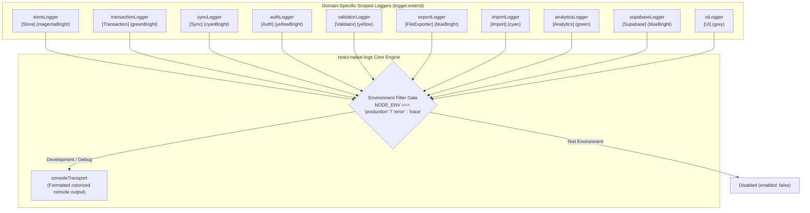
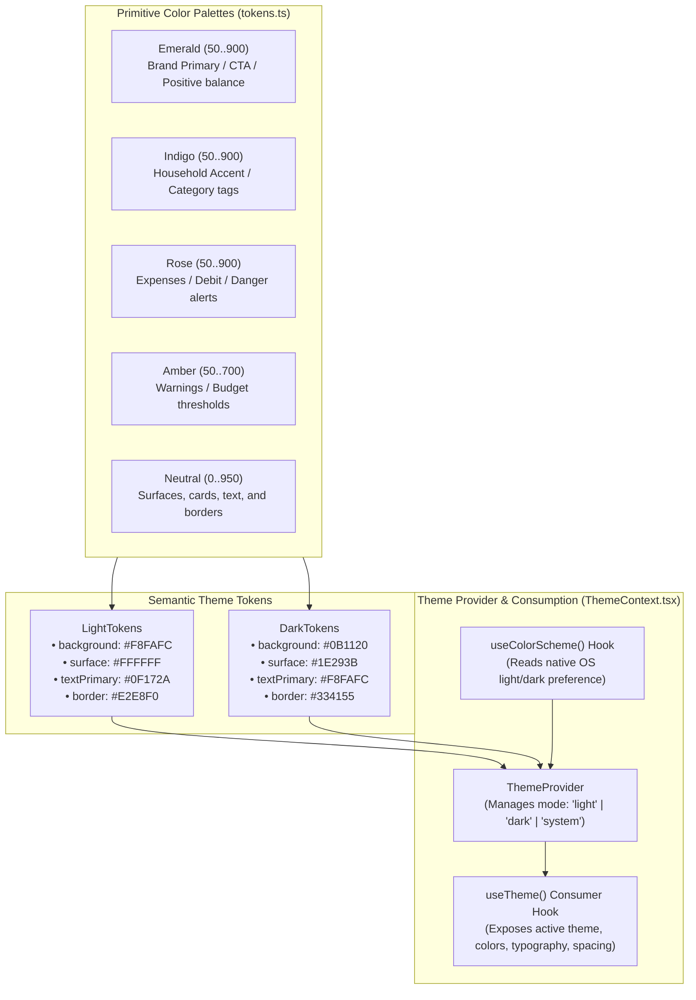
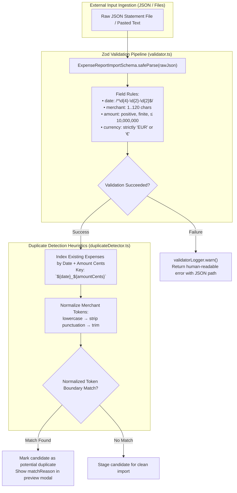

# Cross-Cutting Architectural Concerns

> **Module 06: Logging, Theming, Internationalization & Schema Validation**  
> Foundational Infrastructure: `react-native-logs`, `Zod ^4.5.4`, `React Context`, `TypeScript Unions`

[← Previous: External APIs & Networking](./05-apis-networking-and-proxy.md) | [Index](./index.md) | [Next: SOLID Principles & Patterns →](./07-solid-principles-and-patterns.md)

---

## 1. Scoped Telemetry & Structured Logging Architecture

Application-wide diagnostics and auditing are unified under a zero-cost abstraction built on top of `react-native-logs` in [`src/services/logger.ts`](file:///home/berto/bert0ns-family-management/src/services/logger.ts#L1-L60).



### Logging Configuration Specifications

1. **Severity Filtering:** In development environments, severity is configured to `'trace'`, capturing detailed state mutations, network round-trips, and cache hits. In production builds, severity is throttled to `'error'`, preventing performance degradation and sensitive terminal leaks.
2. **Subsystem Extension Namespaces:** Each application domain interacts exclusively with its scoped sub-logger (e.g. `transactionLogger.info('Expense created', { id, amount })`), ensuring log streams are clearly categorized in debugging consoles.
3. **Automated Test Silencing:** In test execution contexts (`NODE_ENV === 'test'`), logging is globally suppressed (`enabled: false`) to maintain pristine test runner output.

---

## 2. Theme System & Design Token Hierarchy

Visual styling is driven by a comprehensive token system declared in [`src/theme/tokens.ts`](file:///home/berto/bert0ns-family-management/src/theme/tokens.ts#L1-L150) and provided to the component tree via [`ThemeContext.tsx`](file:///home/berto/bert0ns-family-management/src/theme/ThemeContext.tsx#L1-L80).



### Design Token Specifications

- **Typography Scale:** Declares standard font sizes and line heights (`xs: 12`, `sm: 14`, `base: 16`, `lg: 18`, `xl: 20`, `2xl: 24`, `3xl: 30`).
- **Spacing Scale:** Standard 4px grid (`xs: 4`, `sm: 8`, `md: 12`, `lg: 16`, `xl: 20`, `2xl: 24`, `3xl: 32`, `4xl: 40`).
- **Border Radii:** Semantic corner roundings (`sm: 6`, `md: 10`, `lg: 16`, `full: 9999`).
- **Elevation & Shadows:** Multi-tier elevation maps for web (`box-shadow`) and native platforms (`elevation` / `shadowColor`).

---

## 3. Internationalization (i18n) Engine

The application delivers complete bidirectional localization for English (`en`) and Italian (`it`) through [`src/i18n/`](file:///home/berto/bert0ns-family-management/src/i18n/index.ts#L1-L10).

```mermaid
flowchart TB
    subgraph Dictionaries ["Type-Safe Translation Dictionaries"]
        EnglishDict["en.ts (English Dictionary)<br/>100% key coverage"]
        ItalianDict["it.ts (Italian Dictionary)<br/>100% key coverage"]
        CategoryMap["categories.ts<br/>(Maps category names to translation keys)"]
    end

    subgraph TranslationContext ["I18n Context Provider (I18nContext.tsx)"]
        LocaleState["Active Language State: 'en' | 'it'"]
        TranslationFunction["t(key: TranslationKey, params?: Record): string"]
        TranslateCategory["tCategory(categoryName: string): string"]
    end

    subgraph UIComponents ["UI Presentation Layer"]
        ScreenText["Screen Headers & Buttons"]
        CategoryBadges["Category Badges & Filters"]
    end

    EnglishDict --> TranslationContext
    ItalianDict --> TranslationContext
    CategoryMap --> TranslationContext

    TranslationContext -->|t('common.save')| ScreenText
    TranslationContext -->|tCategory('Groceries') -> 'Spesa'| CategoryBadges
```

### Dynamic Category Localization

Because categories can be custom-created by users or provided by system defaults, [`src/i18n/categories.ts`](file:///home/berto/bert0ns-family-management/src/i18n/categories.ts#L1-L45) provides a deterministic mapping function:

```typescript
export function getCategoryTranslationKey(categoryName: string): TranslationKey | null {
  const normalized = categoryName.toLowerCase().trim();
  return CATEGORY_I18N_KEY_MAP[normalized] || null;
}
```

If a category name matches a known system identifier, it resolves to the localized string (e.g. "Spesa" in Italian, "Groceries" in English). If it is a custom user-created tag, it gracefully falls back to the user's raw string literal.

---

## 4. Schema Validation & Data Integrity

Data integrity is guarded at the application boundary using **Zod** in [`src/services/validator.ts`](file:///home/berto/bert0ns-family-management/src/services/validator.ts#L1-L40) and heuristic token matching in [`src/services/duplicateDetector.ts`](file:///home/berto/bert0ns-family-management/src/services/duplicateDetector.ts#L1-L85).



---

## 5. Architectural Gaps & Technical Debt

1. **Missing Remote Log Transport:** The scoped logger currently logs solely to local device console transports. For production crash diagnostics, an opt-in remote transport (e.g. Sentry or Datadog) should be conditionally plugged into `logger.ts`.
2. **Missing Dynamic Number & Currency Formatting:** Number formatting currently relies on simple string concatenation (`€ ${amount.toFixed(2)}`) rather than the native `Intl.NumberFormat` API, preventing regional decimal separator conventions (e.g. `1.234,56 €` in Italy vs `€1,234.56` in English).
3. **Static Locale Storage:** Language selection is retained in React state rather than persisted across cold boots in AsyncStorage, resetting to device default on app restart.

---

[← Previous: External APIs & Networking](./05-apis-networking-and-proxy.md) | [Index](./index.md) | [Next: SOLID Principles & Patterns →](./07-solid-principles-and-patterns.md)
