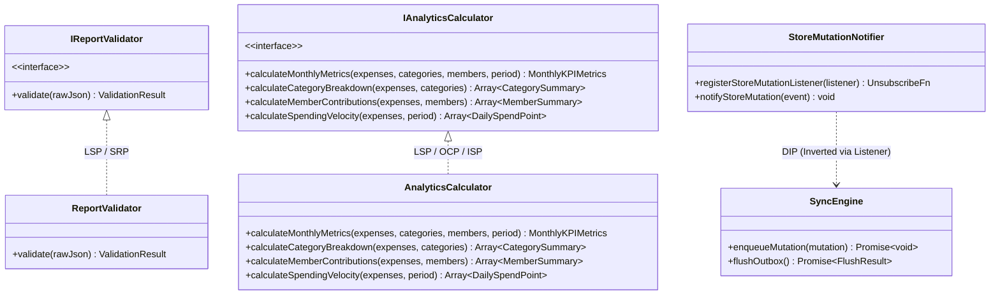

# SOLID Principles & Design Patterns Architecture

> **Module 07: Software Architecture Governance & Design Patterns**  
> Standards: `SOLID Principles, GoF Patterns & Domain-Driven Segregation`

[← Previous: Cross-Cutting Concerns](./06-cross-cutting-concerns.md) | [Index](./index.md) | [Next: Testing Strategy & CI/CD →](./08-testing-and-cicd.md)

---

## 1. Concrete SOLID Principles Compliance Matrix

The codebase strictly enforces the SOLID principles across services, stores, and data processors. Each principle is verified through line-cited references to concrete source implementations.

| Principle                                 | Verified Code Symbols & Files                                                                                                                                                                                                                                                                                                        | Implementation Proof & Architectural Invariant                                                                                                                                                                                                                                                                                                                                                                      |
| :---------------------------------------- | :----------------------------------------------------------------------------------------------------------------------------------------------------------------------------------------------------------------------------------------------------------------------------------------------------------------------------------- | :------------------------------------------------------------------------------------------------------------------------------------------------------------------------------------------------------------------------------------------------------------------------------------------------------------------------------------------------------------------------------------------------------------------ |
| **Single Responsibility Principle (SRP)** | 1. [`ReportValidator`](file:///home/berto/bert0ns-family-management/src/services/validator.ts#L10-L38) 2. [`DuplicateDetector`](file:///home/berto/bert0ns-family-management/src/services/duplicateDetector.ts#L15-L80) 3. [`CsvExporter`](file:///home/berto/bert0ns-family-management/src/services/csvExporter.ts#L10-L55) | • `ReportValidator` possesses exactly one reason to change: modifications to the inbound JSON schema. It contains zero storage, network, or UI rendering logic. • `DuplicateDetector` is exclusively responsible for string token normalization and heuristic collision detection. • `CsvExporter` is solely responsible for serializing memory models into RFC 4180 formatted CSV streams.                 |
| **Open/Closed Principle (OCP)**           | 1. [`IAnalyticsCalculator`](file:///home/berto/bert0ns-family-management/src/services/interfaces.ts#L30-L45) 2. [`logger.extend`](file:///home/berto/bert0ns-family-management/src/services/logger.ts#L45-L60)                                                                                                                   | • New financial analytics algorithms, projections, or Runway calculations can be introduced by subclassing or extending `AnalyticsCalculator` without modifying consumer screens or stores. • The telemetry logger can be extended with arbitrary new domain subsystems via `logger.extend('NewDomain')` without modifying the root logger configuration.                                                       |
| **Liskov Substitution Principle (LSP)**   | 1. [`AnalyticsCalculator`](file:///home/berto/bert0ns-family-management/src/services/analytics.ts#L12-L65) 2. [`ReportValidator`](file:///home/berto/bert0ns-family-management/src/services/validator.ts#L10-L38)                                                                                                                | • Concrete implementations of `IAnalyticsCalculator` (including automated test test doubles) can be substituted transparently into UI components without breaking mathematical invariants or throwing unexpected runtime exceptions. • `ReportValidator` guarantees a uniform result contract `{ success: boolean, data?: ..., error?: ... }` under all error conditions without throwing unhandled exceptions. |
| **Interface Segregation Principle (ISP)** | 1. [`src/services/interfaces.ts`](file:///home/berto/bert0ns-family-management/src/services/interfaces.ts#L30-L75) 2. [`useAppStore` Slices](file:///home/berto/bert0ns-family-management/src/services/store.ts#L152-L220)                                                                                                       | • `IAnalyticsCalculator`, `IReportValidator`, and `IExpenseRepository` are strictly segregated. Clients calculating metrics never depend on file import methods or store mutations. • Views subscribe only to the granular state slices they consume (e.g. `useAppStore(s => s.expenses)`), shielding them from updates to notification preferences or sync outbox queues.                                      |
| **Dependency Inversion Principle (DIP)**  | 1. [`registerStoreMutationListener`](file:///home/berto/bert0ns-family-management/src/services/store.ts#L112-L125) 2. [`AnalyticsCalculator`](file:///home/berto/bert0ns-family-management/src/services/analytics.ts#L12-L35)                                                                                                    | • The Zustand store does not import or depend on the concrete `syncEngine`. Instead, it exposes an abstract `StoreMutationEvent` listener registration API, allowing the sync gateway to plug into the store without creating circular or high-to-low dependencies. • High-level UI screens depend on abstract interfaces declared in `interfaces.ts` rather than tight couplings to persistent singletons.     |

---

## 2. SOLID Architectural Topology

---

## 3. Design Patterns Applied Across the Codebase

### 3.1 Asynchronous Outbox Pattern (Reliability & Offline Sync)

Implemented in [`src/services/syncEngine.ts`](file:///home/berto/bert0ns-family-management/src/services/syncEngine.ts#L52-L95). Instead of attempting direct network calls during user mutations, state actions append an [`OutboxMutation`](file:///home/berto/bert0ns-family-management/src/types/index.ts#L10) record into `@bert0ns_sync_outbox`. A decoupled queue processor drains the outbox asynchronously, guaranteeing zero lost transactions during network dropouts.

### 3.2 Observer / Event Emitter Pattern (Decoupled Store Reactivity)

Implemented in [`src/services/store.ts`](file:///home/berto/bert0ns-family-management/src/services/store.ts#L112-L135). The store manages a `Set<StoreMutationListener>`. When any entity mutation (`expense`, `category`, `member`, `settlement`) is committed, all subscribers are notified with a typed payload. This decouples local state management from sync engines and telemetry loggers.

### 3.3 Strategy Pattern (Financial Split Engine)

Implemented in [`src/services/splitCalculator.ts`](file:///home/berto/bert0ns-family-management/src/services/splitCalculator.ts#L7-L80). Splitting algorithms vary based on user requirements:

- Equal Split Strategy (`calculateEqualSplits`)
- Percentage Split Strategy
- Exact Amount Strategy

Each strategy satisfies the invariant that participant shares sum to the exact total transaction amount in integer cents.

### 3.4 Facade Pattern (Supabase Integration Layer)

Implemented in [`src/services/supabase.ts`](file:///home/berto/bert0ns-family-management/src/services/supabase.ts#L1-L35). Masks the underlying configuration complexities, environment variable lookups, and client initialization behind a clean, unified facade (`supabase` and `isSupabaseConfigured()`).

### 3.5 Adapter Pattern (Platform File Sharing & Export)

Implemented in [`src/services/fileExporter.ts`](file:///home/berto/bert0ns-family-management/src/services/fileExporter.ts#L15-L75). Adapts the file generation interface across two drastically different runtime environments:

- Native Mobile: Adapts to `expo-file-system` and `expo-sharing`.
- Web Browser: Adapts to W3C DOM Blobs and programmatic anchor download triggers.

---

## 4. Architectural Gaps & Technical Debt

1. **Direct Concrete Instantiation in Views:** While `interfaces.ts` defines clean contracts, some UI components instantiate `new AnalyticsCalculator()` or import `reportValidator` directly rather than receiving instances through React Context or a lightweight dependency injection container.
2. **Global Mutable Listener Set:** In [`src/services/store.ts`](file:///home/berto/bert0ns-family-management/src/services/store.ts#L110), `mutationListeners` is declared as a module-level global variable. In fast-refresh or multi-instance test environments, stale listeners can accumulate if cleanup callbacks are omitted.

---

[← Previous: Cross-Cutting Concerns](./06-cross-cutting-concerns.md) | [Index](./index.md) | [Next: Testing Strategy & CI/CD →](./08-testing-and-cicd.md)
