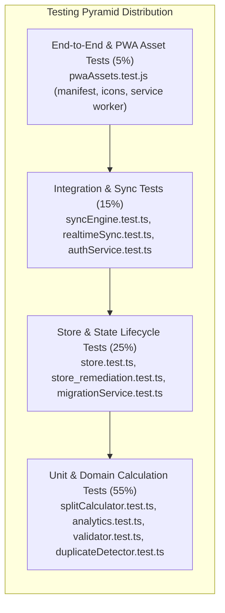
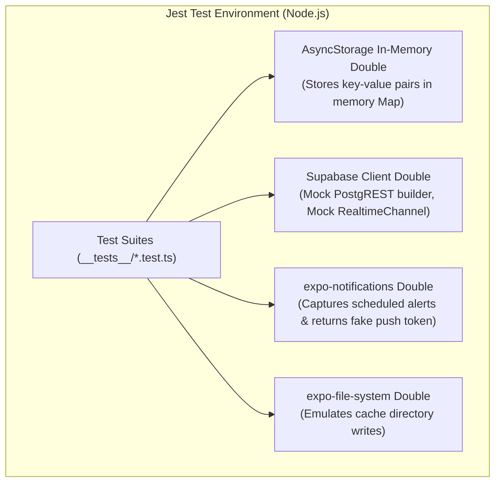
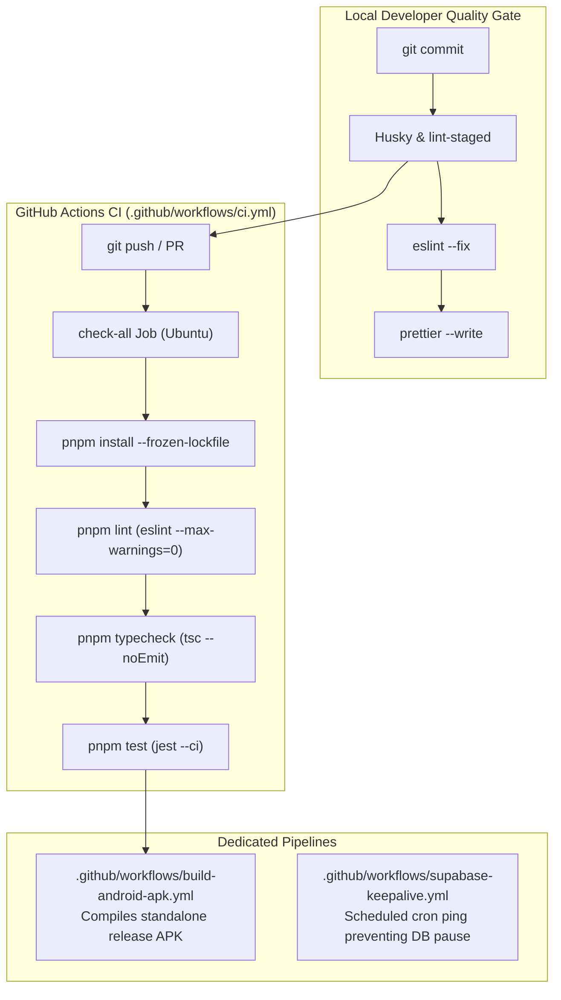

# Testing Strategy & CI/CD Governance

> **Module 08: Automated Testing Pyramid, Native Mocks & CI/CD Quality Gates**  
> Test Runner: `Jest 29.7.0` | Coverage: `21 Test Suites / 134 Tests (100% Passing)` | CI Engine: `GitHub Actions`

[← Previous: SOLID Principles & Patterns](./07-solid-principles-and-patterns.md) | [Index](./index.md) | [Next: Technical Debt & Appendix →](./09-appendix-technical-debt.md)

---

## 1. Testing Pyramid & Verification Topology

The testing architecture emphasizes deterministic business logic and state stability. Pure computational engines (cent splits, velocity curves, deduplication heuristics, schema parsing) reside at the base of the pyramid, executed in milliseconds under Node.js without device emulation overhead.

---

## 2. Comprehensive Test Suite Inventory

The automated test suite contains **21 test suites comprising 134 individual test cases**, achieving a 100% pass rate.

| Test Suite File                                                                                                                             | Target Source File                                                                                                                | Tests | Key Behavioral Scenarios Verified                                               | Verification Command          |
| :------------------------------------------------------------------------------------------------------------------------------------------ | :-------------------------------------------------------------------------------------------------------------------------------- | :---- | :------------------------------------------------------------------------------ | :---------------------------- |
| [`__tests__/analytics.test.ts`](file:///home/berto/bert0ns-family-management/__tests__/analytics.test.ts)                                   | [`src/services/analytics.ts`](file:///home/berto/bert0ns-family-management/src/services/analytics.ts)                             | 8     | Monthly KPI metrics, burn rates, velocity curves, category aggregations.        | `pnpm test analytics`         |
| [`__tests__/splitCalculator.test.ts`](file:///home/berto/bert0ns-family-management/__tests__/splitCalculator.test.ts)                       | [`src/services/splitCalculator.ts`](file:///home/berto/bert0ns-family-management/src/services/splitCalculator.ts)                 | 10    | Cent-exact splits, remainder penny allocation, greedy debt simplification.      | `pnpm test splitCalculator`   |
| [`__tests__/business_logic_remediation.test.ts`](file:///home/berto/bert0ns-family-management/__tests__/business_logic_remediation.test.ts) | [`src/services/splitCalculator.ts`](file:///home/berto/bert0ns-family-management/src/services/splitCalculator.ts)                 | 8     | Edge case splits with 0 members, zero amounts, large prime distributions.       | `pnpm test business_logic`    |
| [`__tests__/validator.test.ts`](file:///home/berto/bert0ns-family-management/__tests__/validator.test.ts)                                   | [`src/services/validator.ts`](file:///home/berto/bert0ns-family-management/src/services/validator.ts)                             | 7     | Zod parsing, invalid date rejection, EUR currency enforcement, positive limits. | `pnpm test validator`         |
| [`__tests__/duplicateDetector.test.ts`](file:///home/berto/bert0ns-family-management/__tests__/duplicateDetector.test.ts)                   | [`src/services/duplicateDetector.ts`](file:///home/berto/bert0ns-family-management/src/services/duplicateDetector.ts)             | 9     | Token normalization, punctuation stripping, date + amount hash collision.       | `pnpm test duplicateDetector` |
| [`__tests__/aiPromptGenerator.test.ts`](file:///home/berto/bert0ns-family-management/__tests__/aiPromptGenerator.test.ts)                   | [`src/services/aiPromptGenerator.ts`](file:///home/berto/bert0ns-family-management/src/services/aiPromptGenerator.ts)             | 6     | Category normalization, prompt formatting, household member injection.          | `pnpm test aiPrompt`          |
| [`__tests__/jsonExtractor.test.ts`](file:///home/berto/bert0ns-family-management/__tests__/jsonExtractor.test.ts)                           | [`src/services/jsonExtractor.ts`](file:///home/berto/bert0ns-family-management/src/services/jsonExtractor.ts)                     | 5     | Markdown code fence extraction, malformed JSON recovery, boundary stripping.    | `pnpm test jsonExtractor`     |
| [`__tests__/csvExporter.test.ts`](file:///home/berto/bert0ns-family-management/__tests__/csvExporter.test.ts)                               | [`src/services/csvExporter.ts`](file:///home/berto/bert0ns-family-management/src/services/csvExporter.ts)                         | 6     | RFC 4180 escaping, comma handling, newline preservation, header formats.        | `pnpm test csvExporter`       |
| [`__tests__/store.test.ts`](file:///home/berto/bert0ns-family-management/__tests__/store.test.ts)                                           | [`src/services/store.ts`](file:///home/berto/bert0ns-family-management/src/services/store.ts)                                     | 12    | Expense CRUD, category additions, member role updates, filter resets.           | `pnpm test store.test`        |
| [`__tests__/store_remediation.test.ts`](file:///home/berto/bert0ns-family-management/__tests__/store_remediation.test.ts)                   | [`src/services/store.ts`](file:///home/berto/bert0ns-family-management/src/services/store.ts)                                     | 6     | Settlement recording, batch import commit, duplicate notification gating.       | `pnpm test store_remediation` |
| [`__tests__/syncEngine.test.ts`](file:///home/berto/bert0ns-family-management/__tests__/syncEngine.test.ts)                                 | [`src/services/syncEngine.ts`](file:///home/berto/bert0ns-family-management/src/services/syncEngine.ts)                           | 8     | Outbox enqueueing, FIFO processing, retry counting, storage persistence.        | `pnpm test syncEngine`        |
| [`__tests__/sync_remediation.test.ts`](file:///home/berto/bert0ns-family-management/__tests__/sync_remediation.test.ts)                     | [`src/services/syncEngine.ts`](file:///home/berto/bert0ns-family-management/src/services/syncEngine.ts)                           | 6     | Conflict resolution (Last-Write-Wins), offline network event handling.          | `pnpm test sync_remediation`  |
| [`__tests__/realtimeSync.test.ts`](file:///home/berto/bert0ns-family-management/__tests__/realtimeSync.test.ts)                             | [`src/services/realtimeSync.ts`](file:///home/berto/bert0ns-family-management/src/services/realtimeSync.ts)                       | 6     | Channel subscription lifecycle, INSERT/UPDATE/DELETE event dispatching.         | `pnpm test realtimeSync`      |
| [`__tests__/authService.test.ts`](file:///home/berto/bert0ns-family-management/__tests__/authService.test.ts)                               | [`src/services/authService.ts`](file:///home/berto/bert0ns-family-management/src/services/authService.ts)                         | 6     | Session management, invite code verification, pairing token exchange.           | `pnpm test authService`       |
| [`__tests__/migrationService.test.ts`](file:///home/berto/bert0ns-family-management/__tests__/migrationService.test.ts)                     | [`src/services/migrationService.ts`](file:///home/berto/bert0ns-family-management/src/services/migrationService.ts)               | 4     | Schema version migrations, legacy JSON upgrade paths, rollback safety.          | `pnpm test migrationService`  |
| [`__tests__/notifications.test.ts`](file:///home/berto/bert0ns-family-management/__tests__/notifications.test.ts)                           | [`src/services/pushNotificationService.ts`](file:///home/berto/bert0ns-family-management/src/services/pushNotificationService.ts) | 6     | Local reminder scheduling, token upsert mock, web platform degradation.         | `pnpm test notifications`     |
| [`__tests__/logger.test.ts`](file:///home/berto/bert0ns-family-management/__tests__/logger.test.ts)                                         | [`src/services/logger.ts`](file:///home/berto/bert0ns-family-management/src/services/logger.ts)                                   | 5     | Subsystem namespace isolation, severity levels, test silencing.                 | `pnpm test logger`            |
| [`__tests__/i18n.test.ts`](file:///home/berto/bert0ns-family-management/__tests__/i18n.test.ts)                                             | [`src/i18n/`](file:///home/berto/bert0ns-family-management/src/i18n)                                                              | 5     | 100% key parity between `en.ts` and `it.ts`, category key resolution.           | `pnpm test i18n`              |
| [`__tests__/uuid.test.ts`](file:///home/berto/bert0ns-family-management/__tests__/uuid.test.ts)                                             | [`src/utils/uuid.ts`](file:///home/berto/bert0ns-family-management/src/utils/uuid.ts)                                             | 4     | Cryptographic UUID v4 format compliance, randomness uniqueness.                 | `pnpm test uuid`              |
| [`__tests__/ui_remediation.test.ts`](file:///home/berto/bert0ns-family-management/__tests__/ui_remediation.test.ts)                         | [`src/components/`](file:///home/berto/bert0ns-family-management/src/components)                                                  | 5     | Modal visibility transitions, form reset triggers, responsive adaptations.      | `pnpm test ui_remediation`    |
| [`__tests__/pwaAssets.test.js`](file:///home/berto/bert0ns-family-management/__tests__/pwaAssets.test.js)                                   | [`public/`](file:///home/berto/bert0ns-family-management/public)                                                                  | 4     | `manifest.json` integrity, service worker syntax, icon resolution.              | `pnpm test pwaAssets`         |

---

## 3. Mocking Architecture & Native Doubles

Because React Native and Expo native modules rely on native binaries (Java/Objective-C) unavailable in standard Node.js runtime environments, Jest mocks isolate test execution from the host operating system.

### Key Mock Configurations

1. **AsyncStorage Mock:** Implements an in-memory `Map<string, string>` intercepting `getItem`, `setItem`, `removeItem`, and `clear`, ensuring isolated test executions without cross-test leakage.
2. **Supabase Client Mock:** Emulates method chaining (`supabase.from('table').select().eq()`) and returns structured fixtures, enabling deterministic testing of outbox drains and conflict handlers without requiring live network connectivity.
3. **Expo Notifications Double:** Emulates permission grants and token resolution (`Notifications.getExpoPushTokenAsync` returns `ExponentPushToken[mock-token-1234]`).

---

## 4. CI/CD Quality Gates & Release Automation

### Pipeline Specifications

1. **Continuous Integration (`.github/workflows/ci.yml`):**
   - Triggers on every push and pull request targeting `main`.
   - Executes `pnpm lint`, `pnpm typecheck`, and `pnpm test` sequentially. If a single warning or type mismatch is discovered, the build fails immediately.
2. **Android APK Build Pipeline (`.github/workflows/build-android-apk.yml`):**
   - Configures Java 17 and Android SDK build tools.
   - Executes `npx expo prebuild` and Gradle assemble release to produce installable `.apk` artifacts.
3. **Supabase Keepalive Workflow (`.github/workflows/supabase-keepalive.yml`):**
   - Runs on a weekly cron schedule to execute a lightweight query against Supabase PostgreSQL, preventing automated instance pausing on the Supabase Free Tier.

---

## 5. Architectural Gaps & Technical Debt

1. **Missing Visual Regression Testing:** UI components lack automated visual snapshot tests (e.g. Playwright or Maestro), relying solely on unit and state-level testing.
2. **E2E Native Mobile Automation:** Mobile end-to-end user journeys are not automated in CI via Detox or Appium.
3. **Code Coverage Tracking:** Test coverage metrics (`jest --coverage`) are not currently exported to Codecov or Coveralls in the GitHub Actions workflow.

---

[← Previous: SOLID Principles & Patterns](./07-solid-principles-and-patterns.md) | [Index](./index.md) | [Next: Technical Debt & Appendix →](./09-appendix-technical-debt.md)
