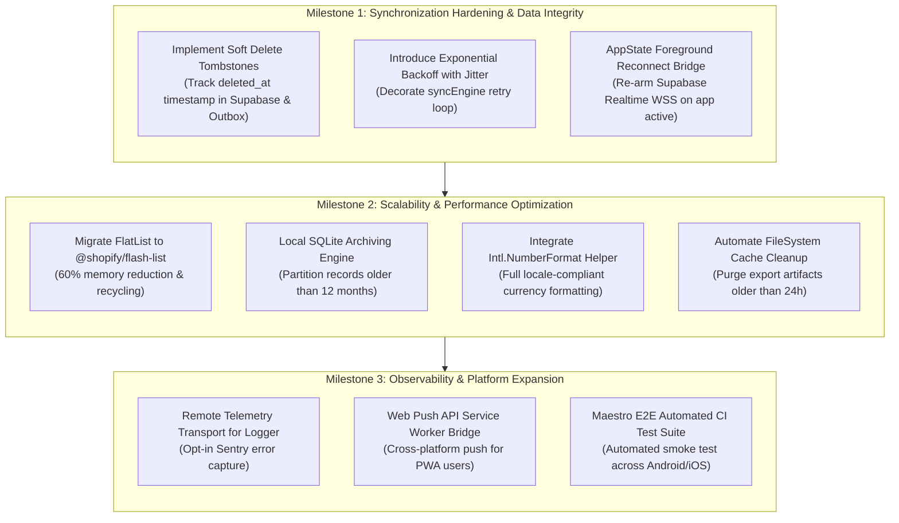

# Technical Debt Matrix & Remediation Roadmap

> **Module 09: Architectural Appendix, Gap Analysis & Technical Debt Governance**  
> Tracking Standards: `Prioritized Architectural Backlog & 3-Milestone Execution Roadmap`

[← Previous: Testing Strategy & CI/CD](./08-testing-and-cicd.md) | [Index](./index.md)

---

## 1. Prioritized Technical Debt Master Matrix

This matrix consolidates architectural observations, performance bottlenecks, and edge-case vulnerabilities discovered during the comprehensive codebase audit.

| Gap ID     | Subsystem                | Severity | Description                                                                                          | Architectural Risk                                                                                          | Impacted Module                                       | Remediation Milestone |
| :--------- | :----------------------- | :------- | :--------------------------------------------------------------------------------------------------- | :---------------------------------------------------------------------------------------------------------- | :---------------------------------------------------- | :-------------------- |
| **GAP-01** | **Sync Engine**          | `HIGH`   | Absence of randomized exponential backoff with jitter during network sync retries.                   | Rapid retry loops during cloud outages can degrade client battery and trigger HTTP 429 rate limits.         | [`05-apis`](./05-apis-networking-and-proxy.md)        | **Milestone 1**       |
| **GAP-02** | **Sync Engine**          | `HIGH`   | Lack of soft-delete tombstone tracking across multi-device synchronizations.                         | An offline device flushing stale state can inadvertently re-insert a deleted transaction ("zombie record"). | [`05-apis`](./05-apis-networking-and-proxy.md)        | **Milestone 1**       |
| **GAP-03** | **Realtime**             | `MEDIUM` | Silent WebSocket disconnection during iOS deep backgrounding without automatic foreground reconnect. | Users returning to app after extended backgrounding may observe stale ledgers until manual pull-to-refresh. | [`05-apis`](./05-apis-networking-and-proxy.md)        | **Milestone 1**       |
| **GAP-04** | **State Store**          | `MEDIUM` | In-memory unbounded storage of entire expense history in Zustand array.                              | As household records exceed 5,000+ items, JSON serialization in AsyncStorage will cause memory spikes.      | [`03-state`](./03-state-management-and-domain.md)     | **Milestone 2**       |
| **GAP-05** | **UI / Virtualization**  | `MEDIUM` | Use of standard React Native `FlatList` rather than `@shopify/flash-list`.                           | Frame drops and blank cells during rapid scrolling on low-end Android hardware.                             | [`02-screens`](./02-screens-and-navigation.md)        | **Milestone 2**       |
| **GAP-06** | **Telemetry**            | `MEDIUM` | Scoped logger lacks opt-in remote error transport (Sentry / Datadog).                                | Production crashes or unhandled Zod rejection patterns cannot be monitored in real time.                    | [`06-concerns`](./06-cross-cutting-concerns.md)       | **Milestone 3**       |
| **GAP-07** | **Internationalization** | `LOW`    | Currency formatting uses hardcoded concatenation instead of `Intl.NumberFormat`.                     | Regional decimal and thousand separator discrepancies (e.g. `1.250,50 €` vs `€1,250.50`).                   | [`06-concerns`](./06-cross-cutting-concerns.md)       | **Milestone 2**       |
| **GAP-08** | **Native Platform**      | `LOW`    | Temporary CSV/JSON export files in `FileSystem.cacheDirectory` are never purged.                     | Gradual sandboxed storage accumulation on user devices over multiple years of export operations.            | [`04-sensors`](./04-sensors-kinematics-and-native.md) | **Milestone 2**       |
| **GAP-09** | **PWA Platform**         | `LOW`    | Lack of W3C Web Push notification integration for Web PWA users.                                     | Desktop browser users do not receive automated daily expense logging prompts.                               | [`04-sensors`](./04-sensors-kinematics-and-native.md) | **Milestone 3**       |
| **GAP-10** | **Testing**              | `LOW`    | Absence of automated mobile E2E UI test suites (Detox / Maestro) in GitHub Actions.                  | Regressions in complex multi-screen modal navigation could bypass unit and component tests.                 | [`08-testing`](./08-testing-and-cicd.md)              | **Milestone 3**       |

---

## 2. Three-Milestone Remediation Roadmap

---

## 3. Detailed Milestone Action Specifications

### Milestone 1: Synchronization Hardening & Data Integrity

- **Target Deadline:** Immediate Sprint (Sprint 1)
- **Primary Objectives:**
  1. Add `deleted_at TIMESTAMPTZ NULL` column to `expenses` and `settlements` in `src/data/supabase_schema.sql`. Update [`syncEngine.ts`](file:///home/berto/bert0ns-family-management/src/services/syncEngine.ts) to push soft-deletes and filter out tombstones during query operations.
  2. Implement an exponential backoff decorator in [`syncEngine.ts`](file:///home/berto/bert0ns-family-management/src/services/syncEngine.ts) calculating retry delays:

     $$\Delta t = \min(t_{\text{max}}, t_{\text{base}} \times 2^{\text{retry\_count}}) \pm \text{jitter}$$

  3. Register an `AppState.addEventListener('change', ...)` handler in [`realtimeSync.ts`](file:///home/berto/bert0ns-family-management/src/services/realtimeSync.ts) to verify WebSocket channel health and reconnect upon transitioning from `background` to `active`.

### Milestone 2: Scalability & Performance Optimization

- **Target Deadline:** Medium-Term Sprint (Sprint 2)
- **Primary Objectives:**
  1. Replace `FlatList` with `@shopify/flash-list` in [`src/app/(tabs)/ledger.tsx`](<file:///home/berto/bert0ns-family-management/src/app/(tabs)/ledger.tsx>) with estimated cell sizing (`estimatedItemSize={72}`).
  2. Implement a temporal partitioner in [`useAppStore`](file:///home/berto/bert0ns-family-management/src/services/store.ts) allowing historical expenses ($> 1\text{ year}$) to be moved into a secondary local store or fetched on demand.
  3. Replace currency formatting helpers with `new Intl.NumberFormat(locale, { style: 'currency', currency: 'EUR' })` in [`src/theme/tokens.ts`](file:///home/berto/bert0ns-family-management/src/theme/tokens.ts).
  4. Schedule a background sweep in [`src/services/fileExporter.ts`](file:///home/berto/bert0ns-family-management/src/services/fileExporter.ts) removing cached export files with creation dates exceeding 24 hours.

### Milestone 3: Observability & Platform Expansion

- **Target Deadline:** Long-Term Roadmap (Sprint 3)
- **Primary Objectives:**
  1. Add an optional remote error transport to [`src/services/logger.ts`](file:///home/berto/bert0ns-family-management/src/services/logger.ts) that reports warnings and errors when `process.env.EXPO_PUBLIC_SENTRY_DSN` is configured.
  2. Author and register an offline Service Worker (`public/sw.js`) with push and notificationclick listeners to support desktop web browser notifications.
  3. Configure a Maestro UI flow in `.github/workflows/ci.yml` executing simulated add expense and split calculation user flows.

---

[← Previous: Testing Strategy & CI/CD](./08-testing-and-cicd.md) | [Index](./index.md)
