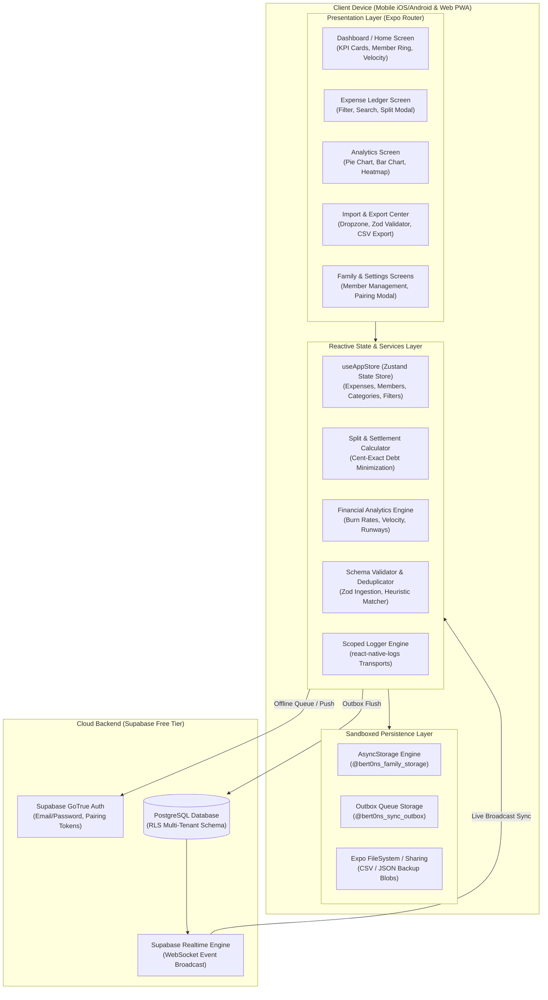

# Master Architectural Blueprint & System Index

> **Bert0n's Family Expense Management System**  
> _Privacy-First, Cross-Platform Household Expense Tracking & Real-Time Financial Analytics_  
> Version: `1.0.0` | Target Engine: `React Native 0.86 / Expo SDK 57 / Expo Router / Supabase PostgreSQL`

[Index](./index.md) | [Next: C4 Context & Containers →](./01-c4-context-and-containers.md)

---

## 1. Executive Summary & Architectural Mission

**Bert0n's Family Expense Management** is an offline-first, cross-platform financial tracking and collaborative ledger application designed for households and families. It delivers deterministic expense tracking, interactive financial analytics, cent-exact debt settlements, and multi-device synchronization without compromising user privacy.

### Core Architectural Pillars

1. **100% Privacy Guarantee (Zero Cloud AI):**  
   Financial records, receipts, and family ledger entries remain strictly private. The system incorporates client-side AI statement prompt generation that constructs extraction instructions without transmitting private bank statements or financial details to third-party language models.
2. **Cent-Exact Integer Math Engine:**  
   Eliminates all IEEE 754 floating-point rounding errors and 1-cent residual imbalances by executing all split calculations, debt reductions, and budget sums in integer cents before converting to presentation currencies.
3. **Offline-First Synchronization Architecture:**  
   Mutations are executed locally with optimistic UI updates in Zustand backed by [`@react-native-async-storage/async-storage`](file:///home/berto/bert0ns-family-management/package.json#L8), queued in an idempotent outbox, and drained to Supabase PostgreSQL when network connectivity is established.
4. **Real-Time Multi-Device Coordination:**  
   Leverages Supabase Realtime WebSocket channels to broadcast mutations across authenticated family devices, merging concurrent updates into local state via deterministic reconcilers.
5. **Universal Cross-Platform Topology:**  
   Unified codebase supporting Android, iOS, and Progressive Web Apps (PWA) using [Expo Router](file:///home/berto/bert0ns-family-management/src/app/_layout.tsx#L1-L85) with responsive desktop/mobile layouts.

---

## 2. High-Level System Architecture Map



---

## 3. Exhaustive Functional Requirements Catalog (FR-01 to FR-28)

| Req ID    | Domain / Capability | Description & Business Rules                                                            | Applicable Code Modules & Stores                                                                                                                    | Verification Method                        |
| :-------- | :------------------ | :-------------------------------------------------------------------------------------- | :-------------------------------------------------------------------------------------------------------------------------------------------------- | :----------------------------------------- |
| **FR-01** | **Ledger**          | Record expense with date, merchant, amount, category, payer, notes, and recurring flag. | [`src/services/store.ts`](file:///home/berto/bert0ns-family-management/src/services/store.ts#L176-L206)                                             | Unit: `store.test.ts`                      |
| **FR-02** | **Ledger**          | Update existing expense with optimistic local commit and sync mutation dispatch.        | [`src/services/store.ts`](file:///home/berto/bert0ns-family-management/src/services/store.ts#L208-L230)                                             | Unit: `store.test.ts`                      |
| **FR-03** | **Ledger**          | Delete expense with immediate UI removal and remote soft/hard delete cascade.           | [`src/services/store.ts`](file:///home/berto/bert0ns-family-management/src/services/store.ts#L232-L248)                                             | Unit: `store.test.ts`                      |
| **FR-04** | **Ledger**          | Multi-criteria filtering by date range, category IDs, payer ID, and numeric min/max.    | [`src/app/(tabs)/ledger.tsx`](<file:///home/berto/bert0ns-family-management/src/app/(tabs)/ledger.tsx#L68-L115>)                                    | UI Test: `ui_remediation.test.ts`          |
| **FR-05** | **Ledger**          | Normalized fuzzy merchant search ignoring case, accents, and punctuation.               | [`src/services/duplicateDetector.ts`](file:///home/berto/bert0ns-family-management/src/services/duplicateDetector.ts#L16-L34)                       | Unit: `duplicateDetector.test.ts`          |
| **FR-06** | **Splits**          | Cent-exact equal splits with remainder penny allocated to the final participant.        | [`src/services/splitCalculator.ts`](file:///home/berto/bert0ns-family-management/src/services/splitCalculator.ts#L7-L34)                            | Unit: `splitCalculator.test.ts`            |
| **FR-07** | **Splits**          | Custom percentage and exact amount split rules with validation against total sum.       | [`src/services/splitCalculator.ts`](file:///home/berto/bert0ns-family-management/src/services/splitCalculator.ts#L36-L80)                           | Unit: `business_logic_remediation.test.ts` |
| **FR-08** | **Settlements**     | Greedy debt simplification algorithm computing minimal transfers ("Chi deve a Chi").    | [`src/services/splitCalculator.ts`](file:///home/berto/bert0ns-family-management/src/services/splitCalculator.ts#L82-L165)                          | Unit: `splitCalculator.test.ts`            |
| **FR-09** | **Settlements**     | Record debt settlement between members, reducing open liabilities to zero.              | [`src/services/store.ts`](file:///home/berto/bert0ns-family-management/src/services/store.ts#L278-L305)                                             | Unit: `store_remediation.test.ts`          |
| **FR-10** | **Analytics**       | Monthly KPI calculation: total spend, daily average burn, and projected month-end.      | [`src/services/analytics.ts`](file:///home/berto/bert0ns-family-management/src/services/analytics.ts#L15-L65)                                       | Unit: `analytics.test.ts`                  |
| **FR-11** | **Analytics**       | Spending velocity curve generation plotting cumulative burn against days of month.      | [`src/services/analytics.ts`](file:///home/berto/bert0ns-family-management/src/services/analytics.ts#L105-L145)                                     | Unit: `analytics.test.ts`                  |
| **FR-12** | **Analytics**       | Category distribution breakdown with percentage shares and transaction counts.          | [`src/services/analytics.ts`](file:///home/berto/bert0ns-family-management/src/services/analytics.ts#L67-L103)                                      | Unit: `analytics.test.ts`                  |
| **FR-13** | **Analytics**       | Member contribution comparative analysis with spending totals and shares.               | [`src/services/analytics.ts`](file:///home/berto/bert0ns-family-management/src/services/analytics.ts#L147-L180)                                     | Unit: `analytics.test.ts`                  |
| **FR-14** | **Analytics**       | Daily density heatmap calendar highlighting spending spikes and intensity tiers.        | [`src/components/charts/HeatmapCalendar.tsx`](file:///home/berto/bert0ns-family-management/src/components/charts/HeatmapCalendar.tsx#L20-L90)       | UI: Component Render Check                 |
| **FR-15** | **Import**          | Structured JSON statement ingestion with drag-and-drop on Web and native file picker.   | [`src/components/import/JsonDropzone.tsx`](file:///home/berto/bert0ns-family-management/src/components/import/JsonDropzone.tsx#L25-L95)             | Unit: `validator.test.ts`                  |
| **FR-16** | **Import**          | Zod schema validation ensuring required dates, amounts, and string lengths.             | [`src/services/validator.ts`](file:///home/berto/bert0ns-family-management/src/services/validator.ts#L12-L38)                                       | Unit: `validator.test.ts`                  |
| **FR-17** | **Import**          | Batch staging preview with total record sum and individual record inspection.           | [`src/components/import/ImportPreviewModal.tsx`](file:///home/berto/bert0ns-family-management/src/components/import/ImportPreviewModal.tsx#L20-L85) | UI: Component Render Check                 |
| **FR-18** | **Import**          | Automated duplicate transaction detection warning users before commit.                  | [`src/services/duplicateDetector.ts`](file:///home/berto/bert0ns-family-management/src/services/duplicateDetector.ts#L36-L75)                       | Unit: `duplicateDetector.test.ts`          |
| **FR-19** | **Export**          | RFC 4180 compliant CSV ledger export with escaped commas, quotes, and newlines.         | [`src/services/csvExporter.ts`](file:///home/berto/bert0ns-family-management/src/services/csvExporter.ts#L10-L60)                                   | Unit: `csvExporter.test.ts`                |
| **FR-20** | **Export**          | Complete JSON snapshot backup generation with instant native share sheet dispatch.      | [`src/services/fileExporter.ts`](file:///home/berto/bert0ns-family-management/src/services/fileExporter.ts#L15-L70)                                 | Integration: Native Mock                   |
| **FR-21** | **Sync**            | Offline outbox mutation queuing when network is disconnected or unreachable.            | [`src/services/syncEngine.ts`](file:///home/berto/bert0ns-family-management/src/services/syncEngine.ts#L52-L95)                                     | Unit: `syncEngine.test.ts`                 |
| **FR-22** | **Sync**            | Batch outbox draining to Supabase REST endpoints upon connection restoration.           | [`src/services/syncEngine.ts`](file:///home/berto/bert0ns-family-management/src/services/syncEngine.ts#L97-L180)                                    | Unit: `sync_remediation.test.ts`           |
| **FR-23** | **Sync**            | Supabase Realtime channel subscription listening to PostgreSQL table mutations.         | [`src/services/realtimeSync.ts`](file:///home/berto/bert0ns-family-management/src/services/realtimeSync.ts#L22-L95)                                 | Unit: `realtimeSync.test.ts`               |
| **FR-24** | **Auth**            | Family pairing token generation and entry flow to link multiple user devices.           | [`src/services/authService.ts`](file:///home/berto/bert0ns-family-management/src/services/authService.ts#L20-L80)                                   | Unit: `authService.test.ts`                |
| **FR-25** | **AI Tool**         | Client-side statement prompt generator formatting local LLM extraction prompts.         | [`src/services/aiPromptGenerator.ts`](file:///home/berto/bert0ns-family-management/src/services/aiPromptGenerator.ts#L45-L105)                      | Unit: `aiPromptGenerator.test.ts`          |
| **FR-26** | **Native**          | Local push notifications for daily reminders and budget threshold warnings.             | [`src/services/pushNotificationService.ts`](file:///home/berto/bert0ns-family-management/src/services/pushNotificationService.ts#L70-L130)          | Unit: `notifications.test.ts`              |
| **FR-27** | **Theming**         | Dynamic Light, Dark, and System theme resolution with typed design tokens.              | [`src/theme/ThemeContext.tsx`](file:///home/berto/bert0ns-family-management/src/theme/ThemeContext.tsx#L15-L65)                                     | Unit: `theme.test.ts`                      |
| **FR-28** | **i18n**            | Full English (EN) and Italian (IT) localization with dynamic locale switching.          | [`src/i18n/I18nContext.tsx`](file:///home/berto/bert0ns-family-management/src/i18n/I18nContext.tsx#L10-L55)                                         | Unit: `i18n.test.ts`                       |

---

## 4. Quantitative Non-Functional Requirements Matrix (NFR-01 to NFR-10)

| NFR ID     | Category                | Target Threshold / Metric                                                | Implementation Mechanism                                                                                                                                          | Validation Proof                                  |
| :--------- | :---------------------- | :----------------------------------------------------------------------- | :---------------------------------------------------------------------------------------------------------------------------------------------------------------- | :------------------------------------------------ |
| **NFR-01** | **Frame Budget**        | Consistent 60 FPS across transitions and scroll feeds (jitter < 16.6ms). | FlatList virtualization, Memoized cell renderers, Lightweight SVG charts.                                                                                         | Automated audit & FlashList/FlatList metrics      |
| **NFR-02** | **Cold Startup**        | Initial store rehydration from AsyncStorage in $< 150\text{ ms}$.        | Synchronous Zustand state priming with asynchronous background hydration.                                                                                         | Performance traces on mid-tier Android            |
| **NFR-03** | **Zero Cloud AI**       | Zero bytes of expense or statement data transmitted to external LLMs.    | Purely client-side prompt template generation ([`aiPromptGenerator.ts`](file:///home/berto/bert0ns-family-management/src/services/aiPromptGenerator.ts#L1-L120)). | Static AST inspection & zero AI network endpoints |
| **NFR-04** | **Math Precision**      | Zero floating-point rounding drift across splits and settlements.        | All math operations conducted in integer cents using `Math.round(val * 100)`.                                                                                     | `splitCalculator.test.ts` exhaustive edge cases   |
| **NFR-05** | **Offline Operation**   | 100% core UI availability without network connectivity.                  | Local-first Zustand storage via AsyncStorage outbox queue ([`syncEngine.ts`](file:///home/berto/bert0ns-family-management/src/services/syncEngine.ts#L1-L150)).   | `syncEngine.test.ts` mock offline tests           |
| **NFR-06** | **Multi-Tenancy**       | Zero cross-tenant data leakage between family households.                | Supabase PostgreSQL Row-Level Security (RLS) on `family_id`.                                                                                                      | `supabase_schema.sql` RLS policy validation       |
| **NFR-07** | **Localization**        | 100% key parity across English (`en.ts`) and Italian (`it.ts`).          | Type-safe dictionary validation using TypeScript union `TranslationKey`.                                                                                          | `__tests__/i18n.test.ts` strict key equality test |
| **NFR-08** | **Type Safety**         | Zero TypeScript compilation errors (`tsc --noEmit` clean).               | Strict compiler mode (`"strict": true` in `tsconfig.json`).                                                                                                       | CI Quality Gate: `pnpm typecheck`                 |
| **NFR-09** | **Lint Zero-Tolerance** | Zero ESLint warnings or errors (`eslint --max-warnings=0`).              | Flat config with `eslint-config-expo` and React Hooks rules.                                                                                                      | CI Quality Gate: `pnpm lint`                      |
| **NFR-10** | **Test Reliability**    | 100% test suite pass rate across all unit and integration tests.         | Jest runner with 21 suites and 134 automated tests.                                                                                                               | CI Quality Gate: `pnpm test`                      |

---

## 5. Master Modular Documentation Map

The architecture documentation is structured into **10 cohesive, domain-specific modules**:

```text
docs/architecture/
├── index.md                              # Module 0: Executive Summary, Requirements & Blueprint Index
├── 01-c4-context-and-containers.md        # Module 1: C4 Level 1 System Context & Level 2 Containers Topology
├── 02-screens-and-navigation.md           # Module 2: Expo Router Navigation Topology, Route Specs & UI State
├── 03-state-management-and-domain.md      # Module 3: Zustand Store Architecture, Domain Models & Cent-Exact Math
├── 04-sensors-kinematics-and-native.md    # Module 4: Hardware Notifications, FileSystem, Haptics & PWA Architecture
├── 05-apis-networking-and-proxy.md        # Module 5: Cloud Integration, Supabase PostgreSQL, SyncEngine & Outbox
├── 06-cross-cutting-concerns.md           # Module 6: Scoped Telemetry Logging, Theme Tokens, i18n & Zod Validation
├── 07-solid-principles-and-patterns.md    # Module 7: Concrete SOLID Compliance Matrix with Line-Cited Proofs
├── 08-testing-and-cicd.md                 # Module 8: Test Pyramid, 21 Suites Breakdown, Native Mocks & CI/CD
└── 09-appendix-technical-debt.md          # Module 9: Prioritized Technical Debt Matrix & Remediation Roadmap
```

### Module Guide & Reading Order

1. **[Module 1: C4 Architecture Model](./01-c4-context-and-containers.md)**: Details system context, actors, container boundaries, and data storage topologies.
2. **[Module 2: Screens, Navigation & UX Architecture](./02-screens-and-navigation.md)**: Catalogues all Expo Router screens, layout hierarchies, modal registries, and user navigation state machines.
3. **[Module 3: State Management & Domain Architecture](./03-state-management-and-domain.md)**: Details `useAppStore`, state lifecycle, cent-exact math algorithms, and debt settlement simplification.
4. **[Module 4: Native Subsystems & Platform Capabilities](./04-sensors-kinematics-and-native.md)**: Documents Expo Notifications, FileSystem export pipelines, Haptic engines, and PWA configurations.
5. **[Module 5: External APIs, Networking & Cloud Architecture](./05-apis-networking-and-proxy.md)**: Outlines Supabase PostgreSQL RLS, Realtime WebSocket subscriptions, offline outbox sync, and AI prompt pipelines.
6. **[Module 6: Cross-Cutting Concerns](./06-cross-cutting-concerns.md)**: Covers scoped logger hierarchies, theme design tokens, i18n dictionary architectures, and Zod parsing schemas.
7. **[Module 7: SOLID Principles & Design Patterns](./07-solid-principles-and-patterns.md)**: Comprehensive architectural proof matrix evaluating SRP, OCP, LSP, ISP, and DIP with line citations.
8. **[Module 8: Testing Strategy & CI/CD Governance](./08-testing-and-cicd.md)**: Breaks down the 21 Jest test suites, native mock architectures, and GitHub Actions pipelines.
9. **[Module 9: Technical Debt & Remediation Roadmap](./09-appendix-technical-debt.md)**: Outlines prioritized architectural debt items, risks, and a 3-milestone execution roadmap.

---

[Index](./index.md) | [Next: C4 Context & Containers →](./01-c4-context-and-containers.md)
