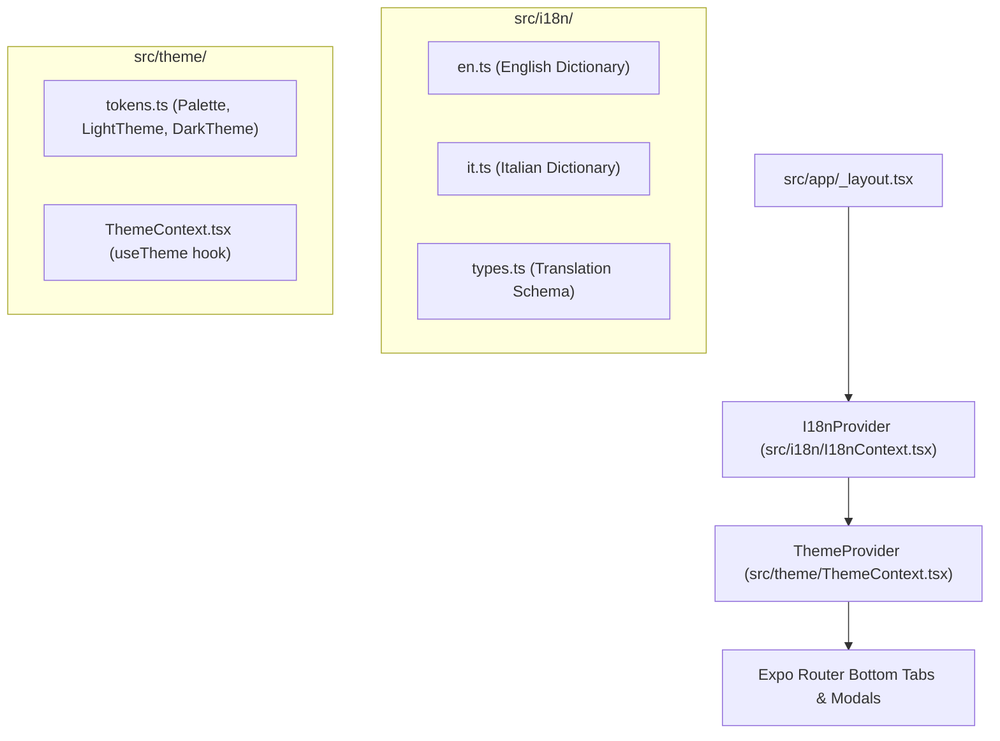

# 🌍 Implementation Plan — Internationalization (EN / IT) & Complete Light/Dark Theme Support

## 1. Overview & Goal Description

Equip the Family Expense Management app with first-class **multilingual support (English `en` and Italian `it`)** and seamless, accessible **Light and Dark theme switching** with persistent preferences.

---

## 2. Architecture & Design Decisions

- **Type Safety:** Translations conform to an explicit `TranslationSchema` interface so missing translation keys in any language are caught at compile-time.
- **Dynamic Reactivity:** Changing language or theme immediately updates all open screens, tabs, modals, and charts without reloading the app.
- **Persistence:** User language preference (`'en' | 'it' | 'system'`) and color scheme preference (`'light' | 'dark' | 'system'`) persist via `@react-native-async-storage/async-storage`.

---

## 3. Workstreams & File Breakdown

### Workstream 1: Localization Layer (`src/i18n/`)

- `src/i18n/types.ts`: Translation schema contract.
- `src/i18n/en.ts`: Complete English localization dictionary.
- `src/i18n/it.ts`: Complete Italian localization dictionary (e.g. _Panoramica Spese_, _Registro Transazioni_, _Buste di Spesa_, _Membri della Famiglia_).
- `src/i18n/I18nContext.tsx`: `I18nProvider` and `useI18n()` hook.
- `src/i18n/index.ts`: Barrel export.

### Workstream 2: Theme System Refinements (`src/theme/`)

- `src/theme/tokens.ts`: Enhanced Dark and Light contrast tokens for card borders, input fields, surfaces, and active tab icons.
- `src/theme/ThemeContext.tsx`: Persistence with AsyncStorage for chosen theme mode.

### Workstream 3: Screen & Component Integration

- `src/app/_layout.tsx`: Wrap root in `<I18nProvider>` and `<ThemeProvider>`.
- `src/app/(tabs)/_layout.tsx`: Localized tab titles (_Dashboard / Panoramica_, _Analytics / Analisi_, _Ledger / Registro_, _Import / Importa_, _Family / Famiglia_).
- `src/app/(tabs)/index.tsx`: Dashboard localized KPI labels, buttons, headers.
- `src/app/(tabs)/analytics.tsx`: Analytics tab headers, merchant rankings, breakdown labels.
- `src/app/(tabs)/ledger.tsx`: Search placeholders, sort options (_Data: Più recente_, _Importo: Più alto_), filter pills.
- `src/app/(tabs)/import.tsx`: Upload instructions, schema viewer, CSV/JSON export actions.
- `src/app/(tabs)/family.tsx`: Interactive Language Selector (English 🇬🇧 / Italiano 🇮🇹) & Theme Selector (Light ☀️ / Dark 🌙 / System ⚙️).
- `src/app/expense/add.tsx`: Manual expense modal input labels, split calculator texts, validation errors.

### Workstream 4: Unit Testing & Quality Gate (`__tests__/`)

- `__tests__/i18n.test.ts`: Verifies complete 1:1 translation key parity between English and Italian dictionaries and parameter formatting.
- `pnpm test`, `pnpm typecheck`, `pnpm format:check` to ensure 0 errors.

---

## 4. Verification Plan

1. **Automated Tests:**
   - Run `pnpm test` (verify all 6 test suites pass).
   - Run `pnpm typecheck` (verify 0 TypeScript compiler errors).
   - Run `pnpm format:check` (verify Prettier compliance).
   - Run `npx expo export -p web` (verify Metro web bundle exports cleanly).
2. **Manual Verification:**
   - Switch language to Italian ➔ Check all tab bar titles, dashboard cards, analytics tabs, ledger sorting dropdowns, and import instructions.
   - Switch theme to Dark / Light ➔ Check contrast on surfaces, modals, inputs, and charts.
