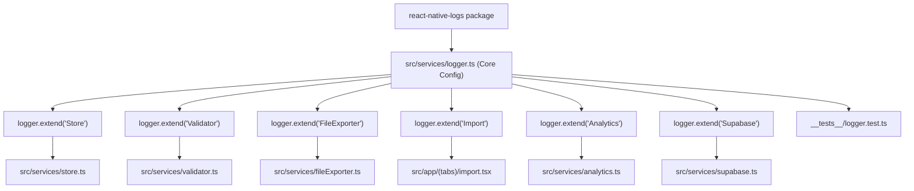

# 📝 Implementation Plan — Structured Logging System

## 1. Context & Architectural Review of `../trenord-infotainment`

An architectural review of the logging implementation in `../trenord-infotainment/lib/logger.ts` reveals the following design patterns:

1. **Library Selection:** Uses [`react-native-logs`](https://github.com/onubo/react-native-logs), a lightweight, zero-dependency, performance-aware logger for React Native and Web.
2. **Environment-Driven Configuration:**
   - **Severity:** Production restricts logs to `error` level; development enables full visibility (`trace` / `debug`).
   - **Async Execution:** Sets `async: true` in non-test environments to prevent blocking the JS thread during high-frequency telemetry, but forces synchronous execution in `test` environment to avoid hanging handles.
   - **Test Cleanliness:** `enabled: process.env.NODE_ENV !== "test"` keeps Jest outputs clean and noise-free unless explicitly enabled in dedicated tests.
3. **Modular Namespacing (`logger.extend`):**
   - Employs domain-based extensions (e.g. `logger.extend("Store")`, `logger.extend("LinkHandler")`).
   - Configures distinct ANSI color tags per extension in `transportOptions.extensionColors` for instant visual scanning in terminal/Metro bundler output.
4. **Transport Flexibility:** Uses `consoleTransport` by default, but the architecture allows seamless expansion to file-based or crash-reporting transports (e.g., Sentry, Bugsnag, or local file logging) in the future.

---

## 2. Adaptation for `bert0ns-family-management`

In `bert0ns-family-management` (Expo SDK 57, React Native 0.83, Zustand persistence, offline-first SQLite/AsyncStorage), introducing this logging pattern will replace ad-hoc `console.error` calls and silent failure paths with structured, queryable telemetry.

### Domain Extensions & Color Palette

| Extension Tag      | Color           | Primary Usage                                                                 |
| :----------------- | :-------------- | :---------------------------------------------------------------------------- |
| **`Store`**        | `magentaBright` | State hydration, persistence sync, member & category CRUD, expense operations |
| **`Validator`**    | `yellowBright`  | JSON import validation, schema mismatches, currency rejections (non-EUR)      |
| **`FileExporter`** | `blueBright`    | Web Blob downloads, Expo FileSystem cache writes, native sharing triggers     |
| **`Import`**       | `cyanBright`    | Dropzone parsing, batch deduplication, payload ingest                         |
| **`Analytics`**    | `greenBright`   | Burn rate metrics, spending velocity calculations, projection milestones      |
| **`Supabase`**     | `cyan`          | Cloud client initialization, connection verification, sync attempts           |
| **`UI`**           | `grey`          | Key modal transitions, filter updates, error alert displays                   |

---

## 3. Architecture & Implementation Steps

---

## 4. Detailed Task Breakdown

### Phase 1: Dependency Installation

- Install `react-native-logs` via `pnpm add react-native-logs`.
- Verify Expo SDK 57 / React 19 compatibility (pure JavaScript/TypeScript package, no native code pods/gradle changes needed).

### Phase 2: Core Logger Module (`src/services/logger.ts`)

- Implement `createLogger` configuration matching our environment standards:
  - Custom levels: `trace` (0), `debug` (1), `info` (2), `log` (2), `warn` (3), `error` (4).
  - Severity gating: `production ? "error" : "trace"`.
  - Color palettes for levels and module extensions.
  - Test disabling flag: `enabled: process.env.NODE_ENV !== "test"`.
- Export root `logger` and pre-configured domain extensions:
  - `storeLogger`
  - `validatorLogger`
  - `exportLogger`
  - `importLogger`
  - `analyticsLogger`
  - `supabaseLogger`

### Phase 3: Instrument Existing Services

1. **`src/services/fileExporter.ts`:**
   - Replace naked `console.error` with `exportLogger.error(...)`.
   - Add `exportLogger.info(...)` on successful cache generation and native share triggering.
2. **`src/services/validator.ts`:**
   - Add `validatorLogger.warn(...)` on schema validation failure with path and error reason.
   - Add `validatorLogger.debug(...)` on successful report validation.
3. **`src/services/store.ts`:**
   - Add `storeLogger.info(...)` on member deletion (logging count of cascaded transactions).
   - Add `storeLogger.debug(...)` on expense additions, updates, and batch imports.
4. **`src/services/supabase.ts`:**
   - Add `supabaseLogger.info(...)` or `supabaseLogger.warn(...)` when credentials are missing or sync is verified.

### Phase 4: Automated Verification & Unit Tests

- Create `__tests__/logger.test.ts`:
  - Test that logger respects `disable()` and suppresses output.
  - Test that `enable()` properly formats and dispatches messages to console transports.
  - Test that extension tags are preserved in formatted messages.
- Run complete quality verification pipeline:
  - `pnpm typecheck`
  - `pnpm test`
  - `pnpm format:check`
