# ⚙️ Implementation Plan — Dedicated Settings Page

## 1. Goal Description

Design and implement a dedicated, comprehensive **Settings Page** for the Family Expense Management App. This separates application-level configurations (Currency, Theme, Language, Cloud Sync Status, Data Backups, Privacy Disclosures) from domain entities (Family Members & Category Budget Envelopes in `FamilyScreen`), creating a clean, professional information architecture.

---

## 2. Architecture & Design Decisions

```mermaid
graph TD
    SettingsScreen["Settings Page (src/app/(tabs)/settings.tsx)"]

    SettingsScreen --> Sec1["1. Household & Profile Preferences"]
    Sec1 --> Sec1_1["Edit Family Name"]
    Sec1 --> Sec1_2["Currency Selector (€ EUR, $ USD, £ GBP, CHF)"]
    Sec1 --> Sec1_3["Active Current Member Profile"]

    SettingsScreen --> Sec2["2. Appearance & Language"]
    Sec2 --> Sec2_1["Theme Switcher (Light / Dark / System)"]
    Sec2 --> Sec2_2["Language Switcher (English / Italiano)"]

    SettingsScreen --> Sec3["3. Cloud Sync & Security (Supabase)"]
    Sec3 --> Sec3_1["Connection Status Indicator (Offline / Connected)"]
    Sec3 --> Sec3_2["Row-Level Security (RLS) Info"]

    SettingsScreen --> Sec4["4. Data Management & Backup"]
    Sec4 --> Sec4_1["Export Full Data Archive (JSON)"]
    Sec4 --> Sec4_2["Reset to Demo / Sample Data"]
    Sec4 --> Sec4_3["Clear All Transactions (Danger Zone)"]

    SettingsScreen --> Sec5["5. About & Privacy Guarantee"]
    Sec5 --> Sec5_1["App Version & Build Info"]
    Sec5 --> Sec5_2["100% Privacy Guarantee (No Cloud AI)"]
```

---

## 3. Workstreams

1. **State Store Updates (`src/services/store.ts`):**
   - Add `updateFamilySettings(updates)`
   - Add `clearAllExpenses()`
2. **Localization (`src/i18n/`):**
   - Update `types.ts`, `en.ts`, `it.ts` with complete `settings` namespace strings.
3. **Settings Screen (`src/app/(tabs)/settings.tsx`):**
   - Build complete modular UI.
4. **Navigation Layout (`src/app/(tabs)/_layout.tsx`):**
   - Add `Settings` tab with gear icon.
5. **Clean up `src/app/(tabs)/family.tsx`:**
   - Remove redundant theme/language cards from Family tab.
6. **Tests & Quality Gate:**
   - Add unit tests in `__tests__/store.test.ts` & `__tests__/i18n.test.ts`.
   - Run `pnpm format`, `pnpm typecheck`, `pnpm test`.
