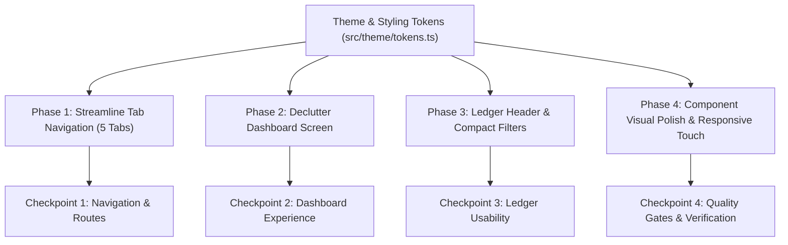

# 🎨 Implementation Plan — UI Simplification & Decluttering

## 1. Overview & Problem Statement

The Family Expense Management app currently exhibits visual density and component duplication that create cognitive fatigue:

- **Tab Bar Overload:** 6 tabs in the bottom bar (`Dashboard`, `Analytics`, `Ledger`, `Import`, `Family`, `Settings`), causing cramped touch targets and label clipping on mobile screens.
- **Dashboard Redundancy:** The Dashboard currently displays the Spending Velocity line chart and Category Pie chart, duplicating the exact visualizations available in Analytics and causing an excessively long vertical scroll (over 3-4 screen heights).
- **Ledger Viewport Consumption:** The Ledger screen consumes ~45% of above-the-fold screen real estate on stacked filter chips (Search bar + Member pills row + Category pills row + Sort bar) before any transactions are visible.
- **Visual Inconsistencies:** Hardcoded contrast backgrounds (`#1E1B4B` / `#EEF2FF`) and competing badge variants distract from core financial data.

This plan simplifies the UI dramatically, removes cognitive clutter, and improves data hierarchy while preserving 100% of underlying functionality (CRUD, split calculations, persistence, export, import, multi-language).

---

## 2. Architecture & Design Decisions

### A. 5-Tab Navigation Layout

Reduce the bottom navigation from 6 tabs to 5 high-utility tabs:

1. **Dashboard (`/`):** Executive glance, total spend, daily average burn, recent transactions.
2. **Ledger (`/ledger`):** Transaction log, search, streamlined filters, and header action for Import/Export.
3. **Analytics (`/analytics`):** The single authoritative home for deep data visualization (Categories Pie, Spending Velocity, Member Breakdown, Heatmap).
4. **Family (`/family`):** Household members, role permissions, category envelopes.
5. **Settings (`/settings`):** Theme, language, EUR currency status, offline storage, full data backups.

_Note:_ The dedicated `/import` screen is retained as an accessible route (`router.push('/(tabs)/import')` or modal), but removed from the bottom bar to eliminate tab crowding.

### B. Dashboard Specialization

- Remove the duplicated `SpendingVelocityChart` and `CategoryPieChart` from the Dashboard.
- Provide a clear "See Full Analytics →" card that transitions seamlessly to `/analytics`.
- Keep the Dashboard focused on what matters in the moment:
  1. Month Stepper & Total Month Spend card.
  2. Daily Average Burn Rate KPI.
  3. Compact Member Contribution avatars & totals.
  4. 5 Most Recent Transactions with quick add & view all actions.

### C. Ledger Filter Bar Streamlining

- Consolidate the 2 horizontal scrolling pill rows into a clean, compact filter header:
  - Search input with clear button.
  - Quick Filter button with active count badge.
  - Display active filter chips _only when filters are applied_, allowing users to dismiss them with one tap.
  - Increases visible transaction rows from 2 to 6+ on standard mobile screens.

### D. Visual Polish & Token Consistency

- Replace hardcoded background hexes with dynamic semantic tokens from `theme.colors`.
- Standardize card spacing and elevation across screens.
- Enhance transaction item typography for clear primary (Merchant, Amount) and secondary (Category, Paid by, Date) hierarchy.

---

## 3. Dependency Graph

---

## 4. Task Breakdown

### Phase 1: Streamline Tab Navigation

Reduce bottom navigation bar crowding to 5 tabs.

#### Task 1.1: Consolidate Tab Bar Layout

**Description:** Update `src/app/(tabs)/_layout.tsx` to hide `import` from the visible tab bar (`href: null`), leaving 5 primary tabs: Dashboard, Ledger, Analytics, Family, Settings.
**Acceptance criteria:**

- [ ] Bottom tab bar displays exactly 5 tabs with ample touch target spacing (min 48px width).
- [ ] `/import` route remains navigable via direct routing (`router.push('/(tabs)/import')`).
- [ ] Header on Ledger includes an "Import" button / icon linking directly to `/import`.
      **Verification:**
- [ ] `pnpm typecheck` succeeds.
- [ ] Manual check on mobile viewport confirms 5 evenly spaced tabs.
      **Files touched:**
- `src/app/(tabs)/_layout.tsx`
- `src/app/(tabs)/ledger.tsx`
  **Estimated scope:** S (2 files)

---

### Phase 2: Declutter Dashboard Screen

Eliminate chart redundancy and make the dashboard an executive overview.

#### Task 2.1: Remove Redundant Visualizations from Dashboard

**Description:** Remove `SpendingVelocityChart` and `CategoryPieChart` from `src/app/(tabs)/index.tsx`. Add an intuitive shortcut card/button guiding users to the Analytics tab for deeper breakdowns.
**Acceptance criteria:**

- [ ] Dashboard renders without `SpendingVelocityChart` and `CategoryPieChart`.
- [ ] Page scroll length is reduced by over 50%, keeping recent transactions immediately visible above or near the fold.
- [ ] Clean card linking to "View Detailed Analytics" navigates to `/(tabs)/analytics`.
- [ ] Unused imports in `src/app/(tabs)/index.tsx` are cleaned up.
      **Verification:**
- [ ] `pnpm typecheck` succeeds.
- [ ] Tests pass: `pnpm test`.
      **Files touched:**
- `src/app/(tabs)/index.tsx`
  **Estimated scope:** S (1 file)

#### Task 2.2: Refine Dashboard Hero & Member Cards

**Description:** Refine the Total Spending card and Member Spending row in `src/app/(tabs)/index.tsx` to use semantic theme tokens instead of hardcoded hex colors, and improve visual alignment.
**Acceptance criteria:**

- [ ] Background colors use `theme.colors.brandLight` / `theme.colors.surfaceSubtle` instead of `#1E1B4B` / `#EEF2FF`.
- [ ] Daily burn rate KPI and Total Spend hero card align seamlessly.
- [ ] Member contribution cards display cleaner typography and spacing.
      **Verification:**
- [ ] Both Dark and Light mode render with contrast meeting WCAG AA standards.
      **Files touched:**
- `src/app/(tabs)/index.tsx`
  **Estimated scope:** S (1 file)

---

### Checkpoint: Navigation & Dashboard (Tasks 1.1 – 2.2)

- [ ] Tab bar has 5 clean tabs.
- [ ] Dashboard is focused, fast, and legible without duplicate charts.
- [ ] Tests pass: `pnpm test`.

---

### Phase 3: Ledger Filter & Header Simplification

Reclaim 40% of vertical screen space on the ledger by replacing dual scrolling pill rows with a compact filter bar.

#### Task 3.1: Create Compact Filter & Sort Bar

**Description:** Refactor the header of `src/app/(tabs)/ledger.tsx`. Replace the two persistent horizontal scroll rows of member and category pills with a single unified search bar, filter trigger button with active count badge, and a sort toggle.
**Acceptance criteria:**

- [ ] Search input takes a single compact row with filter toggle.
- [ ] Filter button opens a lightweight modal allowing selection of member, category, and sort order.
- [ ] When filters are active (e.g. Elena selected, Groceries selected), compact dismissible chips (`[Elena ✕]`, `[Groceries ✕]`) appear beneath search.
- [ ] When no filters are active, zero extra vertical height is consumed, displaying transaction items immediately below search.
      **Verification:**
- [ ] Transaction list has significantly more visible rows on initial screen render.
- [ ] Filtering by member and category works identically to existing behavior.
      **Files touched:**
- `src/app/(tabs)/ledger.tsx`
  **Estimated scope:** M (1-2 files)

---

### Phase 4: Component Visual Polish & Typography Hierarchy

Harmonize card borders, badges, and transaction row typography.

#### Task 4.1: Streamline ExpenseItem Visual Hierarchy

**Description:** Clean up `src/components/ledger/ExpenseItem.tsx` to establish clear typographical contrast:

- Merchant name: bold, prominent.
- Category & date: subtle muted subtitle.
- Member attribution: compact avatar or neat colored dot badge rather than bulky badge blocks.
- Amount: right-aligned, crisp bold text in theme textPrimary.
  **Acceptance criteria:**
- [ ] Each transaction row is clean, scannable, and free from visual clutter.
- [ ] Split indicators and recurring icons are positioned neatly without overcrowding text.
- [ ] Touch targets remain at minimum 48px height for accessibility.
      **Verification:**
- [ ] `pnpm test` passes.
- [ ] Visual verification in light and dark mode.
      **Files touched:**
- `src/components/ledger/ExpenseItem.tsx`
  **Estimated scope:** S (1 file)

#### Task 4.2: Family & Settings Screen Visual Cleanliness

**Description:** Harmonize `src/app/(tabs)/family.tsx` and `src/app/(tabs)/settings.tsx`:

- Replace hardcoded background colors in Family workspace card with semantic theme tokens.
- Ensure consistent section headers, card border radii, and icon sizes across both screens.
  **Acceptance criteria:**
- [ ] Family workspace card matches the app-wide design token system.
- [ ] Section headers across Family and Settings use identical typography weights and margins.
      **Files touched:**
- `src/app/(tabs)/family.tsx`
- `src/app/(tabs)/settings.tsx`
  **Estimated scope:** S (2 files)

---

### Checkpoint: Complete UI Simplification (Tasks 3.1 – 4.2)

- [ ] All 8 automated test suites pass (52+ tests).
- [ ] `pnpm typecheck` reports 0 errors.
- [ ] `pnpm format:check` reports 100% formatted.
- [ ] Human review of screens.

---

## 5. Risks and Mitigations

| Risk                                                           | Impact | Mitigation                                                                                                                    |
| :------------------------------------------------------------- | :----- | :---------------------------------------------------------------------------------------------------------------------------- |
| **User cannot find Import screen after removing from tabs**    | Medium | Prominently place an "Import / Export" action in both the Ledger header and Settings screen, maintaining direct route access. |
| **Analytics charts might feel lost if removed from Dashboard** | Low    | Add an engaging "Detailed Analytics & Charts →" summary card on Dashboard that deep-links to `/analytics`.                    |
| **Filter modal complexity in Ledger**                          | Medium | Keep filter selection simple: use a clean modal dialog with "Apply" and "Reset" buttons.                                      |
